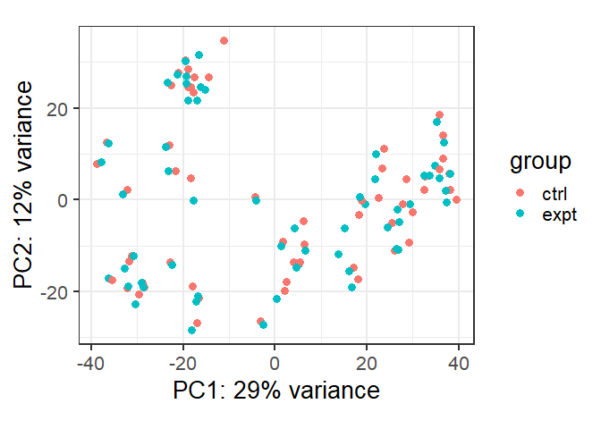

Immune_Bulk_RNAseq_Analysis
================

## Objectives

# Reproduce some of the figures in the journal article “Conserved Interferon-g Signaling Drives Clinical Response to Immune Checkpoint Blockade Therapy in Melanoma” 

# Grasso et al., 2020, Cancer Cell 38, 500–515

# In this study the authors have discovered from an immunotherapy cohort that response to immune checkpoint blockade therapy is associated with T-cell infiltration and interferon gamma (IFNG). They modelled the effect of IFNG on human melanoma cell lines.

# They have treated 58 cell lines with IFNG for 6 hours. Among these, some cell lines included mutations in JAK1/JAK2/B2M which might affect the downstream of IFNG pathway consequently the response to IFNG. They conducted RNA-seq before (control) and after IFNG treatment samples to find the transcriptomic changes.

# Raw gene count data is accessible from GEO with the following accession code: GSE154996

## Setup

``` r
pacman::p_load(tidyverse, readxl, openxlsx, janitor, ggrepel, ggplot2,
               edgeR, DESeq2, EnhancedVolcano, pheatmap,sjmisc,stringr,ComplexHeatmap,
               clusterProfiler,org.Hs.eg.db, AnnotationDbi, conflicted,readxl,gprofiler2)
conflict_prefer("filter", "dplyr") ## IMPORTANT
```

    ## [conflicted] Will prefer dplyr::filter over any other package.

``` r
conflict_prefer("select", "dplyr")
```

    ## [conflicted] Will prefer dplyr::select over any other package.

``` r
conflict_prefer("intersect", "dplyr")
```

    ## [conflicted] Will prefer dplyr::intersect over any other package.

``` r
conflict_prefer("setdiff", "dplyr")
```

    ## [conflicted] Will prefer dplyr::setdiff over any other package.

``` r
rm(list=ls())
```

## Read in count and filtering of genes with no expression

``` r
counts <- read_delim("./data/GSE154996_Raw_Gene_Counts_Matrix.txt") %>% 
  clean_names() 
```

    ## Rows: 19871 Columns: 122
    ## ── Column specification ────────────────────────────────────────────────────────
    ## Delimiter: "\t"
    ## chr   (2): GeneId, GeneChrom
    ## dbl (120): GeneMinPos, GeneMaxPos, GeneBases, GeneExons, M420.Expt.Counts, M...
    ## 
    ## ℹ Use `spec()` to retrieve the full column specification for this data.
    ## ℹ Specify the column types or set `show_col_types = FALSE` to quiet this message.

``` r
counts <- counts %>%
  clean_names() %>%
  select(gene_id, ends_with("_counts")) %>% 
  column_to_rownames("gene_id") 


counts <- counts %>% 
  rename_with(~gsub("_counts", "", .))

n_expressed <- rowSums(counts > 0)
sum(n_expressed==0) #997 genes no expression
```

    ## [1] 997

Note that the `echo = FALSE` parameter was added to the code chunk to
prevent printing of the R code that generated the plot.

``` r
ggplot(data.frame(n_expressed), aes(x=n_expressed)) +
  geom_bar() +
  labs(x="Number of samples expressed in", y="Number of genes") +
  theme_bw(base_size = 20)
```

<!-- -->

``` r
dim(counts) # 19871   116
```

    ## [1] 19871   116

``` r
counts <- counts[ n_expressed > 0, ] 
dim(counts) #18874   116 (997 genes that are not express were removed)
```

    ## [1] 18874   116

## GENE ANNOTATION

``` r
gene_ann <- data.frame(SYMBOL=rownames(counts))  
head(gene_ann, 3)
```

    ##   SYMBOL
    ## 1   A1BG
    ## 2   A1CF
    ## 3    A2M

``` r
map <- clusterProfiler::bitr(gene_ann$SYMBOL,
            fromType = "SYMBOL",
            toType = c("ENTREZID", "GENENAME", "GENETYPE"), 
            OrgDb = "org.Hs.eg.db")
```

    ## 'select()' returned 1:many mapping between keys and columns

    ## Warning in clusterProfiler::bitr(gene_ann$SYMBOL, fromType = "SYMBOL", toType =
    ## c("ENTREZID", : 6.08% of input gene IDs are fail to map...

``` r
tb <- table(map$SYMBOL) 
dup <- names(which(tb > 1)) 
map %>% filter( is.element(SYMBOL, dup) )
```

    ##   SYMBOL  ENTREZID                                            GENENAME
    ## 1    HBD      3045                            hemoglobin subunit delta
    ## 2    HBD 100187828                       hypophosphatemic bone disease
    ## 3   MMD2    221938 monocyte to macrophage differentiation associated 2
    ## 4   MMD2 100505381                        Miyoshi muscular dystrophy 2
    ## 5    TEC      7006                         tec protein tyrosine kinase
    ## 6    TEC 100124696           transient erythroblastopenia of childhood
    ##         GENETYPE
    ## 1 protein-coding
    ## 2        unknown
    ## 3 protein-coding
    ## 4        unknown
    ## 5 protein-coding
    ## 6        unknown

``` r
map <- map %>%
  filter( !is.element(SYMBOL, dup) ) 
dim(map)
```

    ## [1] 17723     4

``` r
gene_ann <- left_join(gene_ann, map)              
```

    ## Joining with `by = join_by(SYMBOL)`

``` r
rownames(gene_ann) <- rownames(counts) 

head(gene_ann)
```

    ##          SYMBOL ENTREZID                                        GENENAME
    ## A1BG       A1BG        1                          alpha-1-B glycoprotein
    ## A1CF       A1CF    29974                  APOBEC1 complementation factor
    ## A2M         A2M        2                           alpha-2-macroglobulin
    ## A2ML1     A2ML1   144568                    alpha-2-macroglobulin like 1
    ## A3GALT2 A3GALT2   127550               alpha 1,3-galactosyltransferase 2
    ## A4GALT   A4GALT    53947 alpha 1,4-galactosyltransferase (P blood group)
    ##               GENETYPE
    ## A1BG    protein-coding
    ## A1CF    protein-coding
    ## A2M     protein-coding
    ## A2ML1   protein-coding
    ## A3GALT2 protein-coding
    ## A4GALT  protein-coding

``` r
rm(tb, dup, map)

dim(gene_ann) # 18874    4
```

    ## [1] 18874     4

## Sample annotation

``` r
sample_ann <- colnames(counts) %>% 
  as.data.frame() %>% 
  setNames("Exp_info") %>% 
  mutate(temp =  sub("_ko_[^_]+$", "", Exp_info),
         Cell_line = sub("_[^_]+$", "", temp), 
         Mutation = ifelse(grepl("jak1_ko", Exp_info),"jak1_ko", 
                           ifelse(grepl("jak2_ko", Exp_info),"jak2_ko",
                                  ifelse(grepl("b2m_ko", Exp_info),"b2m_ko","wt"))),
         Treatment =  str_sub(Exp_info,-4,-1), 
         Treatment =  factor(Treatment, levels=c("ctrl", "expt"))) %>% 
  select(-temp) %>% 
  column_to_rownames('Exp_info') 

sample_ann %>% tabyl(Treatment)
```

    ##  Treatment  n percent
    ##       ctrl 58     0.5
    ##       expt 58     0.5

``` r
write.csv(sample_ann,"./data/sample_ann.csv", row.names = TRUE)
```

## Q1. Generate DESeq2 object using column/count data and make a PCA plot using normalised count data.

## Are control and treatment samples separated on the PCA plot?

``` r
# Check the order of samples in count and sample annotation

identical( colnames(counts), rownames(sample_ann) ) # identical order
```

    ## [1] TRUE

``` r
identical( rownames(counts), rownames(gene_ann) ) # identical order
```

    ## [1] TRUE

``` r
dds <- DESeqDataSetFromMatrix(countData = round(counts),
                              colData = sample_ann,
                              rowData = gene_ann,
                              design = ~ -1 + Treatment + Mutation + Cell_line) 
```

    ## converting counts to integer mode

    ## Warning in DESeqDataSet(se, design = design, ignoreRank): some variables in
    ## design formula are characters, converting to factors

``` r
assay(dds)[ 1:3, 1:5]
```

    ##      m420_expt m420_ctrl wm_1366_ctrl wm_1366_expt m202_ctrl
    ## A1BG       216       296          147          144       132
    ## A1CF         0         0           12           12         0
    ## A2M      39603     11310           88          394       156

``` r
cpm(dds)[1:3, 1:5]
```

    ##       m420_expt m420_ctrl wm_1366_ctrl wm_1366_expt m202_ctrl
    ## A1BG   15.02038  22.16114    8.5674755     9.632616  10.59325
    ## A1CF    0.00000   0.00000    0.6993858     0.802718   0.00000
    ## A2M  2753.94414 846.76535    5.1288289    26.355908  12.51929

``` r
cpm(dds) %>% colSums() %>% head()
```

    ##    m420_expt    m420_ctrl wm_1366_ctrl wm_1366_expt    m202_ctrl    m202_expt 
    ##        1e+06        1e+06        1e+06        1e+06        1e+06        1e+06

``` r
colData(dds)[1:3, ]
```

    ## DataFrame with 3 rows and 3 columns
    ##              Cell_line Mutation Treatment
    ##               <factor> <factor>  <factor>
    ## m420_expt      m420          wt      expt
    ## m420_ctrl      m420          wt      ctrl
    ## wm_1366_ctrl   wm_1366       wt      ctrl

``` r
rowData(dds)[1:3, ]
```

    ## DataFrame with 3 rows and 4 columns
    ##           SYMBOL    ENTREZID               GENENAME       GENETYPE
    ##      <character> <character>            <character>    <character>
    ## A1BG        A1BG           1 alpha-1-B glycoprotein protein-coding
    ## A1CF        A1CF       29974 APOBEC1 complementat.. protein-coding
    ## A2M          A2M           2  alpha-2-macroglobulin protein-coding

``` r
dim(dds) #18874   116
```

    ## [1] 18874   116

``` r
save(dds, file="./data/data_clean.rda", compress=TRUE)
```

## VST expression (Variable stabilizing)

``` r
vst_expr <- vst(dds, blind=FALSE)
norm_count <- assay(vst_expr)

write.csv(norm_count,"./results/normalized_counts.csv", row.names = TRUE) 
```

## PCA Plot (By Treatment)

``` r
plotPCA(vst_expr, intgroup="Treatment") + 
  theme_bw(base_size=20)
```

    ## using ntop=500 top features by variance

<!-- -->
\## PCA Plot (By Mutation)

``` r
plotPCA(vst_expr, intgroup="Mutation") + # Specify color by Treatment as specified in Design
  theme_bw(base_size=20)
```

    ## using ntop=500 top features by variance

<!-- -->
\## Q2. Find differentially expressed genes (DEGs) between pre and post
treatment \## \## samples and compare list of up and down-regulated
genes with author’s list \##

``` r
# Differential Gene Expression

gene_ann <- rowData(dds) %>%
  data.frame() %>%
  select(SYMBOL, ENTREZID)

head(gene_ann, 3)
```

    ##      SYMBOL ENTREZID
    ## A1BG   A1BG        1
    ## A1CF   A1CF    29974
    ## A2M     A2M        2

``` r
dds <- DESeq(dds)
```

    ## estimating size factors

    ## estimating dispersions

    ## gene-wise dispersion estimates

    ## mean-dispersion relationship

    ## final dispersion estimates

    ## fitting model and testing

    ## 10 rows did not converge in beta, labelled in mcols(object)$betaConv. Use larger maxit argument with nbinomWaldTest

``` r
resultsNames(dds)
```

    ##  [1] "Treatmentctrl"       "Treatmentexpt"       "Mutationjak1_ko"    
    ##  [4] "Mutationjak2_ko"     "Mutationwt"          "Cell_linem202"      
    ##  [7] "Cell_linem207"       "Cell_linem233"       "Cell_linem238"      
    ## [10] "Cell_linem238_ar"    "Cell_linem243"       "Cell_linem244"      
    ## [13] "Cell_linem249"       "Cell_linem249_ar"    "Cell_linem257"      
    ## [16] "Cell_linem262"       "Cell_linem263"       "Cell_linem285"      
    ## [19] "Cell_linem297"       "Cell_linem299"       "Cell_linem308"      
    ## [22] "Cell_linem318"       "Cell_linem368"       "Cell_linem370"      
    ## [25] "Cell_linem375"       "Cell_linem376"       "Cell_linem381"      
    ## [28] "Cell_linem383"       "Cell_linem395"       "Cell_linem397"      
    ## [31] "Cell_linem397_ar"    "Cell_linem398"       "Cell_linem399"      
    ## [34] "Cell_linem406"       "Cell_linem407"       "Cell_linem409"      
    ## [37] "Cell_linem410"       "Cell_linem411"       "Cell_linem414"      
    ## [40] "Cell_linem417"       "Cell_linem418"       "Cell_linem420"      
    ## [43] "Cell_lineme215"      "Cell_lineme252"      "Cell_linepb"        
    ## [46] "Cell_lines_bcl2"     "Cell_linesk_mel_176" "Cell_linet1349a"    
    ## [49] "Cell_linet311b"      "Cell_linet618a"      "Cell_linet640a"     
    ## [52] "Cell_linewm_1366"

``` r
# Extract results for ctrl vs. expt 
res <- results(dds, contrast=c("Treatment", "expt", "ctrl")) %>% data.frame() 

res <- res %>%
  rownames_to_column("gene") %>%
  select(SYMBOL=gene, baseMean, LFC=log2FoldChange, p=pvalue, FDR=padj) %>%
  filter(!is.na(LFC), !is.na(FDR)) %>%
  arrange(p) %>%
  left_join(gene_ann) %>% 
  mutate( sig = sign(LFC) * (abs(LFC) > log2(1.5) & FDR < 0.05) )
```

    ## Joining with `by = join_by(SYMBOL)`

``` r
res %>% tabyl(sig) # (downregulated: 41, upregulated: 537)
```

    ##  sig     n     percent
    ##   -1    41 0.002694886
    ##    0 14636 0.962008676
    ##    1   537 0.035296437

``` r
openxlsx::write.xlsx( list(res=res),file="./results/expt_up_deg_L2FC_q_filter.xlsx") 
```

## compare list of up and down-regulated genes with author’s list

``` r
article_selected <- read_excel("./data/mmc3.xlsx", skip = 1) %>%
  select("GeneId") %>% 
  pull()
```

    ## Warning: Expecting numeric in T1008 / R1008C20: got 'NA'

    ## Warning: Expecting numeric in M1013 / R1013C13: got 'NA'

    ## Warning: Expecting numeric in T1101 / R1101C20: got 'NA'

    ## Warning: Expecting numeric in X1220 / R1220C24: got 'NA'

    ## Warning: Expecting numeric in M1414 / R1414C13: got 'NA'

    ## Warning: Expecting numeric in AA1446 / R1446C27: got 'NA'

    ## Warning: Expecting numeric in T1472 / R1472C20: got 'NA'

    ## Warning: Expecting numeric in X1669 / R1669C24: got 'NA'

    ## Warning: Expecting numeric in T1691 / R1691C20: got 'NA'

    ## Warning: Expecting numeric in X1691 / R1691C24: got 'NA'

    ## Warning: Expecting numeric in X1694 / R1694C24: got 'NA'

``` r
res_selected <- res %>% 
  filter(sig != 0) %>%
  select("SYMBOL") %>% 
  pull()

library(VennDiagram)
```

    ## Loading required package: futile.logger

``` r
# Venn Diagram to show intersections of two vectors
#svg(file="./results/venn.svg")
v2 <- venn.diagram( x = list(article_selected, res_selected),
                    category.names = c("article_selected", "res_selected"),
                    filename = NULL)
grid.newpage()
grid.draw(v2)
```

<!-- -->

``` r
#dev.off()

intersected_gene <- Reduce(intersect, list(article_selected,res_selected))
openxlsx::write.xlsx( list(intersected_gene=intersected_gene),file="./results/intersected_gene.xlsx") 

res_gene_only <- Reduce(setdiff, list(res_selected, article_selected))
openxlsx::write.xlsx( list(res_gene_only=res_gene_only),file="./results/res_gene_only.xlsx") 

article_gene_only <- Reduce(setdiff, list(article_selected, res_selected)) %>% 
  as.data.frame() %>% 
  pull()
```

## Getting the list of excluded genes in results vs. authors’ list

## Specify the filtering condition of DEGs by (abs(LFC) \> log2(1.5) & FDR \< 0.05)

``` r
article_selected <- read_excel("./data/mmc3.xlsx", skip = 1)
```

    ## Warning: Expecting numeric in T1008 / R1008C20: got 'NA'

    ## Warning: Expecting numeric in M1013 / R1013C13: got 'NA'

    ## Warning: Expecting numeric in T1101 / R1101C20: got 'NA'

    ## Warning: Expecting numeric in X1220 / R1220C24: got 'NA'

    ## Warning: Expecting numeric in M1414 / R1414C13: got 'NA'

    ## Warning: Expecting numeric in AA1446 / R1446C27: got 'NA'

    ## Warning: Expecting numeric in T1472 / R1472C20: got 'NA'

    ## Warning: Expecting numeric in X1669 / R1669C24: got 'NA'

    ## Warning: Expecting numeric in T1691 / R1691C20: got 'NA'

    ## Warning: Expecting numeric in X1691 / R1691C24: got 'NA'

    ## Warning: Expecting numeric in X1694 / R1694C24: got 'NA'

``` r
library(data.table)  

article_selected_fc <- article_selected[article_selected$GeneId %in% article_gene_only,] %>% 
                      clean_names() %>% 
                      t() %>% 
                      as.data.frame() 
                      
article_selected_fc <- setDT(article_selected_fc, keep.rownames = "cell_line") %>%  
                       row_to_names(row_number = 1) %>%
                       mutate(cell_line =  sub("_log2fold_[^_]+$", "", gene_id)) %>% 
                       select(c(cell_line, PHF20, SLC26A2, KANK2))   
  
openxlsx::write.xlsx( list(article_selected_fc=article_selected_fc),file="./results/article_selected_fc.xlsx")
```

## Getting the list of intersected genes in our results vs. authors’ list

``` r
article_selected <- read_excel("./data/mmc3.xlsx", skip = 1)
```

    ## Warning: Expecting numeric in T1008 / R1008C20: got 'NA'

    ## Warning: Expecting numeric in M1013 / R1013C13: got 'NA'

    ## Warning: Expecting numeric in T1101 / R1101C20: got 'NA'

    ## Warning: Expecting numeric in X1220 / R1220C24: got 'NA'

    ## Warning: Expecting numeric in M1414 / R1414C13: got 'NA'

    ## Warning: Expecting numeric in AA1446 / R1446C27: got 'NA'

    ## Warning: Expecting numeric in T1472 / R1472C20: got 'NA'

    ## Warning: Expecting numeric in X1669 / R1669C24: got 'NA'

    ## Warning: Expecting numeric in T1691 / R1691C20: got 'NA'

    ## Warning: Expecting numeric in X1691 / R1691C24: got 'NA'

    ## Warning: Expecting numeric in X1694 / R1694C24: got 'NA'

``` r
intersected_selected_fc <- article_selected[article_selected$GeneId %in% intersected_gene,] %>% 
                           clean_names() %>% 
                           t() %>% 
                           as.data.frame() 

intersected_selected_fc <- setDT(intersected_selected_fc, keep.rownames = "cell_line") %>%  
  row_to_names(row_number = 1) %>%
  mutate(cell_line =  sub("_log2fold_[^_]+$", "", gene_id)) %>% 
  select(c(cell_line, IRF1, STAT3, TRAFD1))   

openxlsx::write.xlsx( list(intersected_selected_fc=intersected_selected_fc),file="./results/intersected_selected_fc.xlsx")
```

## Q3. Make a volcano plot of up and down-regulated genes.

``` r
# Volcano Plot
# Visualize the biological (log fold change) vs. statistical significance (FDR)

#svg(file="./results/upregulated_genes_treatment.svg")
EnhancedVolcano(res, # results file (non-normalized)
                lab = res$SYMBOL, x = "LFC", y = "FDR",
                FCcutoff = log2(2), pCutoff = 0.05,
                title = "Upregulated genes with IFN-g treatment", subtitle = NULL,
                ylab = bquote(~-Log[10] ~ italic(FDR)), legendPosition = "none")
```

<!-- -->

``` r
#dev.off()
```

## Q4. What are the top up and down regulated pathways?

## Reproduce similar Enrichment Plots in Fig. S9.

``` r
# GSEA with Hallmark

res <- read_excel("./results/expt_up_deg_L2FC_q_filter.xlsx")
ranked <- res %>% 
  arrange( desc(LFC) ) %>% # can also consider p-value for ranking
  select(ENTREZID, LFC) %>%
  na.omit() %>%
  deframe()

length(ranked)
```

    ## [1] 14546

``` r
# Next, prepare the Hallmark database

hallmark <- msigdbr::msigdbr(species = "human", category = "H") %>%
  select(gs_name, entrez_gene) %>%
  unique() %>%
  mutate( gs_name = gsub("HALLMARK_", "", gs_name) )

# Now run GSEA on Hallmark and look at the top few significant pathways:

gsea_hallmark <- GSEA(gene = ranked, TERM2GENE = hallmark)
```

    ## preparing geneSet collections...

    ## GSEA analysis...

    ## Warning in preparePathwaysAndStats(pathways, stats, minSize, maxSize, gseaParam, : There are ties in the preranked stats (0.05% of the list).
    ## The order of those tied genes will be arbitrary, which may produce unexpected results.

    ## Warning in fgseaMultilevel(pathways = pathways, stats = stats, minSize =
    ## minSize, : For some pathways, in reality P-values are less than 1e-10. You can
    ## set the `eps` argument to zero for better estimation.

    ## leading edge analysis...

    ## done...

``` r
gsea_hallmark <- setReadable(gsea_hallmark, OrgDb=org.Hs.eg.db, keyType="ENTREZID")

gsea_hallmark@result %>%
  filter(p.adjust < 1e-4) %>%
  arrange(NES) %>% 
  select(setSize, NES, p.adjust)
```

    ##                           setSize      NES     p.adjust
    ## TNFA_SIGNALING_VIA_NFKB       190 1.858026 2.214749e-05
    ## IL2_STAT5_SIGNALING           181 1.923092 1.663376e-06
    ## COMPLEMENT                    172 2.040347 6.332572e-09
    ## INFLAMMATORY_RESPONSE         170 2.085753 1.250000e-09
    ## IL6_JAK_STAT3_SIGNALING        73 2.170264 6.269678e-09
    ## ALLOGRAFT_REJECTION           146 2.222827 1.250000e-09
    ## INTERFERON_ALPHA_RESPONSE      95 2.495564 1.250000e-09
    ## INTERFERON_GAMMA_RESPONSE     185 2.589653 1.250000e-09

``` r
#svg(file="./results/Dot_blot_HM.svg")
dotplot(gsea_hallmark, showCategory=20) + labs(title="GSEA_Hallmark")
```

<!-- -->

``` r
#dev.off()
```

## GSEA Plot (INTERFERON_GAMMA_RESPONSE)

``` r
keep <- gsea_hallmark@result %>% 
  filter(ID=="INTERFERON_GAMMA_RESPONSE") %>% 
  pull(core_enrichment) %>% 
  str_split(pattern="\\/") %>% 
  unlist() %>% 
  rev()          

keep <- data.frame(SYMBOL=keep)

left_join(keep, res)
```

    ## Joining with `by = join_by(SYMBOL)`

    ##       SYMBOL     baseMean       LFC            p          FDR ENTREZID sig
    ## 1       MT2A  5248.925338 0.4112088 6.416850e-07 1.037470e-05     4502   0
    ## 2       CCL5    38.797889 0.4232798 7.764103e-02 1.938350e-01     6352   0
    ## 3      RNF31   876.391512 0.4312247 2.574588e-22 1.988314e-20    55072   0
    ## 4      PSMA3  1156.632125 0.4474589 2.615276e-28 2.706721e-26     5684   0
    ## 5        IL6    90.522423 0.4499099 1.094929e-02 4.402286e-02     3569   0
    ## 6     IFITM2   619.349878 0.4693866 1.212432e-05 1.439964e-04    10581   0
    ## 7   LGALS3BP 16020.570977 0.4838867 1.474967e-16 7.581129e-15     3959   0
    ## 8      STAT4     4.181784 0.5032862 2.388837e-02 8.062061e-02     6775   0
    ## 9      TDRD7   558.337564 0.5104507 6.936556e-14 2.762638e-12    23424   0
    ## 10   TNFAIP2   545.270861 0.5164404 1.118141e-05 1.343685e-04     7127   0
    ## 11       MVP  3577.927663 0.5318353 2.222750e-10 6.049537e-09     9961   0
    ## 12     HLA-G   162.785659 0.5363634 3.405361e-07 5.834365e-06     3135   0
    ## 13     NAMPT  1305.117833 0.5591942 1.399222e-14 5.946301e-13    10135   0
    ## 14    ARID5B   796.058498 0.5794513 2.265796e-14 9.444333e-13    84159   0
    ## 15       B2M 11235.901772 0.5976003 3.531153e-16 1.738607e-14      567   1
    ## 16      IRF4  1112.758048 0.6335036 3.681596e-08 7.478212e-07     3662   1
    ## 17      CD40   176.901971 0.6406691 3.347403e-04 2.543826e-03      958   1
    ## 18     RIPK2   586.584173 0.6482729 2.273354e-17 1.230847e-15     8767   1
    ## 19   EIF2AK2   969.456464 0.6503953 1.147623e-16 5.959024e-15     5610   1
    ## 20    TRIM26  1469.437512 0.6764851 1.049928e-29 1.219359e-27     7726   1
    ## 21     TAPBP  4480.199309 0.6824271 8.248444e-36 1.410021e-33     6892   1
    ## 22     CASP8   369.183423 0.6830252 1.161232e-25 1.083864e-23      841   1
    ## 23     HLA-B  6773.052444 0.7171432 1.299282e-15 6.026609e-14     3106   1
    ## 24      NOD1   306.645616 0.7212089 6.701750e-21 4.592812e-19    10392   1
    ## 25     PSME1  1386.519765 0.7263580 1.876125e-36 3.243565e-34     5720   1
    ## 26  HLA-DRB1  2521.346775 0.7497272 2.392749e-04 1.910933e-03     3123   1
    ## 27    IFNAR2   569.942820 0.7602458 3.284134e-29 3.673883e-27     3455   1
    ## 28   HLA-DMA   970.195861 0.7684246 4.966908e-09 1.153688e-07     3108   1
    ## 29       CFB    31.363921 0.8091293 2.045044e-07 3.664699e-06      629   1
    ## 30      ADAR  8319.557051 0.8102451 2.273636e-28 2.385593e-26      103   1
    ## 31    TRIM14   772.011855 0.8300928 1.762337e-24 1.549838e-22     9830   1
    ## 32     RBCK1  2048.042794 0.8408216 1.917157e-31 2.492960e-29    10616   1
    ## 33       MX2   669.009576 0.8581966 4.331894e-06 5.796432e-05     4600   1
    ## 34      GCH1   146.676364 0.9175413 2.765396e-15 1.241083e-13     2643   1
    ## 35      SOD2  2509.349044 0.9276497 9.322459e-29 1.013085e-26     6648   1
    ## 36    IFITM3  2560.182396 0.9301675 6.141763e-22 4.558087e-20    10410   1
    ## 37       FAS   140.616573 0.9401079 4.967629e-13 1.834405e-11      355   1
    ## 38  SLC25A28   368.265756 0.9406061 1.034132e-30 1.268814e-28    81894   1
    ## 39     MYD88  1138.155092 0.9434605 3.089843e-33 4.477035e-31     4615   1
    ## 40     CASP4   760.952347 0.9455615 7.753967e-34 1.168008e-31      837   1
    ## 41     CASP7   532.633515 0.9867815 1.532153e-40 3.821340e-38      840   1
    ## 42      LCP2   138.477383 0.9924371 4.241657e-06 5.695725e-05     3937   1
    ## 43      OGFR  2412.023910 1.0151391 7.885067e-47 2.925937e-44    11054   1
    ## 44  HLA-DQA1   411.262898 1.0262625 9.549948e-05 8.779028e-04     3117   1
    ## 45     PSME2   647.782956 1.0411399 1.410658e-45 4.806056e-43     5721   1
    ## 46    IL10RA     7.132753 1.0447785 7.501030e-04 5.049587e-03     3587   1
    ## 47     HERC6   234.848280 1.0527168 2.358999e-13 8.927813e-12    55008   1
    ## 48      IRF2   538.816292 1.0790978 7.413668e-46 2.623059e-43     3660   1
    ## 49     ZNFX1  4025.788707 1.0794737 3.093636e-37 5.603165e-35    57169   1
    ## 50      CD74 11323.040120 1.0864599 5.705005e-07 9.363101e-06      972   1
    ## 51      JAK2   399.550496 1.0990042 1.481571e-17 8.317570e-16     3717   1
    ## 52     VAMP5   402.670848 1.1259020 5.198749e-14 2.109167e-12    10791   1
    ## 53     PTPN6    10.067589 1.1429569 8.249824e-08 1.570874e-06     5777   1
    ## 54     STAT3  4707.183501 1.2188599 7.324195e-42 1.954917e-39     6774   1
    ## 55    RNF213  7359.286227 1.2210142 4.499912e-24 3.912095e-22    57674   1
    ## 56       MX1   937.727183 1.2231166 2.155743e-17 1.181370e-15     4599   1
    ## 57    TRIM25  3727.403537 1.3284755 1.422093e-38 2.738698e-36     7706   1
    ## 58      LAP3  2033.657870 1.3685385 6.582792e-35 1.043235e-32    51056   1
    ## 59    TRAFD1   959.279103 1.3699457 5.386211e-42 1.463318e-39    10906   1
    ## 60     ISG20   233.545917 1.3783595 6.753333e-20 4.298962e-18     3669   1
    ## 61      CCL2  1049.646371 1.3877274 1.843408e-13 7.100153e-12     6347   1
    ## 62     USP18   143.152569 1.3878546 2.011023e-19 1.243728e-17    11274   1
    ## 63     VCAM1    24.378202 1.4143134 1.650581e-02 6.068025e-02     7412   0
    ## 64      CCL7     9.784163 1.4658840 1.290479e-02 5.012344e-02     6354   0
    ## 65       C1R   897.451652 1.4713149 8.509294e-28 8.573536e-26      715   1
    ## 66      IRF7   409.046366 1.4761586 2.256393e-25 2.067998e-23     3665   1
    ## 67    PLSCR1  1517.060341 1.4802917 5.258815e-39 1.066768e-36     5359   1
    ## 68      OAS3  2503.771894 1.4887280 4.618735e-28 4.684629e-26     4940   1
    ## 69       IL7    36.290861 1.5078396 2.418671e-21 1.711519e-19     3574   1
    ## 70    SAMHD1   834.719609 1.5838780 1.599679e-32 2.192569e-30    25939   1
    ## 71     IFI27   443.137359 1.5850755 5.671026e-11 1.685137e-09     3429   1
    ## 72    PARP12   859.684987 1.5866237 3.639338e-40 8.651389e-38    64761   1
    ## 73     DHX58   237.674918 1.6039911 6.949024e-37 1.215201e-34    79132   1
    ## 74       PML  2528.122347 1.6425578 2.485084e-46 9.001921e-44     5371   1
    ## 75     ISG15   719.718921 1.6463739 1.292839e-22 1.003533e-20     9636   1
    ## 76    PSMB10   873.758951 1.6882093 2.106956e-45 6.678174e-43     5699   1
    ## 77       CFH   223.928674 1.7110518 3.451116e-07 5.906105e-06     3075   1
    ## 78     PSMB8  1727.739491 1.8066086 7.689936e-54 4.333137e-51     5696   1
    ## 79      GBP6     2.559096 1.8110851 1.986439e-02 6.978411e-02   163351   0
    ## 80     IFI44   311.902305 1.9018449 4.582615e-18 2.630940e-16    10561   1
    ## 81     CASP1   131.978724 1.9032053 2.021627e-19 1.245224e-17      834   1
    ## 82      IRF9   731.881598 1.9041478 6.191428e-43 1.777290e-40    10379   1
    ## 83     IFI35  1184.352546 1.9185841 4.629770e-51 2.071686e-48     3430   1
    ## 84     DDX60   330.377448 1.9317686 4.728376e-32 6.366152e-30    55601   1
    ## 85     HELZ2  4096.151927 1.9349121 1.044869e-35 1.766293e-33    85441   1
    ## 86     SP110   785.489485 1.9424667 1.893013e-53 9.600099e-51     3431   1
    ## 87      BST2  1373.144813 1.9673010 1.569019e-20 1.046976e-18      684   1
    ## 88     STAT2  2530.729430 1.9941873 3.598434e-51 1.658987e-48     6773   1
    ## 89       C1S   838.458609 1.9977937 1.224019e-28 1.311424e-26      716   1
    ## 90     IFIT1   339.890052 2.0152267 3.396357e-22 2.583609e-20     3434   1
    ## 91    TRIM21   741.995597 2.2036874 1.197104e-60 1.071337e-57     6737   1
    ## 92     IFI30   718.142759 2.2094846 4.673485e-39 9.740054e-37    10437   1
    ## 93       NMI   296.485785 2.2103927 7.791811e-55 4.741785e-52     9111   1
    ## 94     SOCS3  1219.522094 2.2520456 1.808067e-31 2.371374e-29     9021   1
    ## 95     STAT1  7177.544791 2.2585728 4.103170e-61 3.901602e-58     6772   1
    ## 96     IFIH1   555.357172 2.3195422 2.017074e-40 4.949638e-38    64135   1
    ## 97    UBE2L6  1615.985993 2.4468163 1.491003e-53 8.101473e-51     9246   1
    ## 98     PSMB9  1006.016242 2.5416751 3.131951e-50 1.323597e-47     5698   1
    ## 99      RTP4   192.946026 2.5447814 3.677762e-39 7.771316e-37    64108   1
    ## 100    ICAM1 11185.081035 2.7626642 2.207546e-44 6.717122e-42     3383   1
    ## 101    CMPK2   321.005228 2.7649905 1.885095e-35 3.117373e-33   129607   1
    ## 102    SOCS1   195.408787 2.8572859 1.691572e-53 8.874336e-51     8651   1
    ## 103    IFIT2   557.313609 2.8596992 1.655654e-41 4.269341e-39     3433   1
    ## 104   PARP14  3263.877970 2.8711981 8.567809e-63 1.086255e-59    54625   1
    ## 105   IL15RA   181.412294 2.9073002 1.527267e-45 5.051271e-43     3601   1
    ## 106  TNFSF10   130.230927 2.9609525 7.522266e-20 4.768490e-18     8743   1
    ## 107   SAMD9L  1091.569604 2.9889737 1.563701e-45 5.061732e-43   219285   1
    ## 108    NLRC5  1267.979566 3.0391129 2.127759e-61 2.158115e-58    84166   1
    ## 109     OASL   203.476219 3.0550746 1.061078e-22 8.364372e-21     8638   1
    ## 110     OAS2  1214.051905 3.0870752 3.259410e-29 3.673234e-27     4939   1
    ## 111 SERPING1   312.007688 3.1059939 2.295414e-30 2.771621e-28      710   1
    ## 112    RSAD2   161.575423 3.1815449 1.980344e-23 1.628592e-21    91543   1
    ## 113   EPSTI1   126.065238 3.1878388 8.191571e-20 5.171226e-18    94240   1
    ## 114     IL15    44.157098 3.2110277 6.530172e-47 2.483751e-44     3600   1
    ## 115    IFIT3  1833.863647 3.2882788 5.896552e-54 3.450390e-51     3437   1
    ## 116   SECTM1  2017.462663 3.3176293 2.963450e-45 9.201209e-43     6398   1
    ## 117    CD274   727.883149 3.5748689 4.655187e-60 3.727580e-57    29126   1
    ## 118     TAP1 10033.877199 3.6159385 1.438442e-75 4.376893e-72     6890   1
    ## 119   IL18BP   465.324446 3.6719617 1.240661e-62 1.451955e-59    10068   1
    ## 120   IFI44L   222.462615 3.8266590 3.325078e-23 2.705226e-21    10964   1
    ## 121    APOL6  3383.473515 3.8889409 1.535018e-71 3.336252e-68    80830   1
    ## 122    CIITA  2316.969371 4.3606125 1.107236e-47 4.433024e-45     4261   1
    ## 123     IRF8    47.002416 4.5245533 1.272763e-09 3.243519e-08     3394   1
    ## 124     XAF1   247.593760 4.5933285 3.309312e-42 9.323680e-40    54739   1
    ## 125     IRF1  5261.283037 4.7111519 6.336630e-93 9.640550e-89     3659   1
    ## 126   CXCL11   116.623183 4.7824575 6.721499e-30 7.927200e-28     6373   1
    ## 127    BATF2   806.141009 5.0925883 2.661847e-87 2.024867e-83   116071   1
    ## 128    CXCL9   223.172364 5.3325387 5.225396e-29 5.760810e-27     4283   1
    ## 129     GBP4  1100.113217 6.3702026 1.371914e-83 5.218075e-80   115361   1
    ## 130   CXCL10   410.189101 6.4606790 1.266093e-55 8.374929e-53     3627   1
    ## 131     IDO1   928.460415 8.4146107 1.502817e-69 2.857982e-66     3620   1

``` r
# Visualize the enrichment for this pathway

#svg(file="./results/Hallmark INTERFERON_GAMMA_RESPONSE.svg")
gseaplot(gsea_hallmark, geneSetID = "INTERFERON_GAMMA_RESPONSE", title = "Enrichment plot: \n HALLMARK_INTERFERON_GAMMA_RESPONSE")
```

<!-- -->

``` r
#dev.off()
```

## GSEA-GO

``` r
#Running GSEA-GO##
res_up_GO_BP <-gseGO(ranked, 'org.Hs.eg.db', ont="BP", pvalueCutoff=0.01) 
```

    ## preparing geneSet collections...

    ## GSEA analysis...

    ## Warning in preparePathwaysAndStats(pathways, stats, minSize, maxSize, gseaParam, : There are ties in the preranked stats (0.05% of the list).
    ## The order of those tied genes will be arbitrary, which may produce unexpected results.

    ## Warning in fgseaMultilevel(pathways = pathways, stats = stats, minSize =
    ## minSize, : There were 19 pathways for which P-values were not calculated
    ## properly due to unbalanced (positive and negative) gene-level statistic values.
    ## For such pathways pval, padj, NES, log2err are set to NA. You can try to
    ## increase the value of the argument nPermSimple (for example set it nPermSimple
    ## = 10000)

    ## Warning in fgseaMultilevel(pathways = pathways, stats = stats, minSize =
    ## minSize, : For some of the pathways the P-values were likely overestimated. For
    ## such pathways log2err is set to NA.

    ## Warning in fgseaMultilevel(pathways = pathways, stats = stats, minSize =
    ## minSize, : For some pathways, in reality P-values are less than 1e-10. You can
    ## set the `eps` argument to zero for better estimation.

    ## leading edge analysis...

    ## done...

``` r
res_up_GO_BP <- setReadable(res_up_GO_BP, OrgDb=org.Hs.eg.db, keyType="ENTREZID")
## Pull out the top ranking terms. Add geneID to see the genes involved.
res_up_GO_BP@result %>%
  filter(p.adjust < 1e-5) %>%
  select(Description, setSize, NES, p.adjust)
```

    ##                                                                                                                                                 Description
    ## GO:0051607                                                                                                                        defense response to virus
    ## GO:0140546                                                                                                                     defense response to symbiont
    ## GO:0009615                                                                                                                                response to virus
    ## GO:0034341                                                                                                                   response to type II interferon
    ## GO:0048002                                                                                           antigen processing and presentation of peptide antigen
    ## GO:0071346                                                                                                          cellular response to type II interferon
    ## GO:0019882                                                                                                              antigen processing and presentation
    ## GO:0048525                                                                                                             negative regulation of viral process
    ## GO:0019884                                                                                         antigen processing and presentation of exogenous antigen
    ## GO:0140888                                                                                                            interferon-mediated signaling pathway
    ## GO:0002250                                                                                                                         adaptive immune response
    ## GO:0050792                                                                                                                      regulation of viral process
    ## GO:0001906                                                                                                                                     cell killing
    ## GO:1903900                                                                                                                   regulation of viral life cycle
    ## GO:0002460                        adaptive immune response based on somatic recombination of immune receptors built from immunoglobulin superfamily domains
    ## GO:0019079                                                                                                                         viral genome replication
    ## GO:0002819                                                                                                           regulation of adaptive immune response
    ## GO:0042742                                                                                                                    defense response to bacterium
    ## GO:0002831                                                                                                        regulation of response to biotic stimulus
    ## GO:0002449                                                                                                                     lymphocyte mediated immunity
    ## GO:0002822          regulation of adaptive immune response based on somatic recombination of immune receptors built from immunoglobulin superfamily domains
    ## GO:0050777                                                                                                           negative regulation of immune response
    ## GO:0045088                                                                                                             regulation of innate immune response
    ## GO:0019221                                                                                                              cytokine-mediated signaling pathway
    ## GO:0001819                                                                                                       positive regulation of cytokine production
    ## GO:0009617                                                                                                                            response to bacterium
    ## GO:0002833                                                                                               positive regulation of response to biotic stimulus
    ## GO:0002237                                                                                                         response to molecule of bacterial origin
    ## GO:0002253                                                                                                                    activation of immune response
    ## GO:0032496                                                                                                                   response to lipopolysaccharide
    ## GO:0045089                                                                                                    positive regulation of innate immune response
    ## GO:0050863                                                                                                                  regulation of T cell activation
    ## GO:0031349                                                                                                          positive regulation of defense response
    ## GO:1903037                                                                                                       regulation of leukocyte cell-cell adhesion
    ## GO:0002697                                                                                                            regulation of immune effector process
    ## GO:0007159                                                                                                                     leukocyte cell-cell adhesion
    ## GO:0002443                                                                                                                      leukocyte mediated immunity
    ## GO:0019058                                                                                                                                 viral life cycle
    ## GO:0042110                                                                                                                                T cell activation
    ## GO:0002757                                                                                                     immune response-activating signaling pathway
    ## GO:0032103                                                                                             positive regulation of response to external stimulus
    ## GO:0002764                                                                                                     immune response-regulating signaling pathway
    ## GO:0051249                                                                                                              regulation of lymphocyte activation
    ## GO:0002252                                                                                                                          immune effector process
    ## GO:0016032                                                                                                                                    viral process
    ## GO:0002683                                                                                                     negative regulation of immune system process
    ## GO:1903131                                                                                                                 mononuclear cell differentiation
    ## GO:0002694                                                                                                               regulation of leukocyte activation
    ## GO:0050865                                                                                                                    regulation of cell activation
    ## GO:0002521                                                                                                                        leukocyte differentiation
    ## GO:0002478                                                                                 antigen processing and presentation of exogenous peptide antigen
    ## GO:0045069                                                                                                           regulation of viral genome replication
    ## GO:0032944                                                                                                     regulation of mononuclear cell proliferation
    ## GO:0046651                                                                                                                         lymphocyte proliferation
    ## GO:0045071                                                                                                  negative regulation of viral genome replication
    ## GO:0032943                                                                                                                   mononuclear cell proliferation
    ## GO:0002218                                                                                                             activation of innate immune response
    ## GO:0031348                                                                                                          negative regulation of defense response
    ## GO:0070661                                                                                                                          leukocyte proliferation
    ## GO:0002706                                                                                                       regulation of lymphocyte mediated immunity
    ## GO:0022407                                                                                                                 regulation of cell-cell adhesion
    ## GO:0042098                                                                                                                             T cell proliferation
    ## GO:0071219                                                                                                cellular response to molecule of bacterial origin
    ## GO:0002703                                                                                                        regulation of leukocyte mediated immunity
    ## GO:0002758                                                                                              innate immune response-activating signaling pathway
    ## GO:0071357                                                                                                           cellular response to type I interferon
    ## GO:0070663                                                                                                            regulation of leukocyte proliferation
    ## GO:0006959                                                                                                                          humoral immune response
    ## GO:0071216                                                                                                             cellular response to biotic stimulus
    ## GO:0050670                                                                                                           regulation of lymphocyte proliferation
    ## GO:0050867                                                                                                           positive regulation of cell activation
    ## GO:0060337                                                                                                     type I interferon-mediated signaling pathway
    ## GO:0032479                                                                                                       regulation of type I interferon production
    ## GO:0032606                                                                                                                     type I interferon production
    ## GO:0030098                                                                                                                       lymphocyte differentiation
    ## GO:0002221                                                                                                   pattern recognition receptor signaling pathway
    ## GO:0042129                                                                                                               regulation of T cell proliferation
    ## GO:0002709                                                                                                           regulation of T cell mediated immunity
    ## GO:0051251                                                                                                     positive regulation of lymphocyte activation
    ## GO:0050870                                                                                                         positive regulation of T cell activation
    ## GO:0002456                                                                                                                         T cell mediated immunity
    ## GO:0045824                                                                                                    negative regulation of innate immune response
    ## GO:0071222                                                                                                          cellular response to lipopolysaccharide
    ## GO:0002821                                                                                                  positive regulation of adaptive immune response
    ## GO:0046631                                                                                                                     alpha-beta T cell activation
    ## GO:0050727                                                                                                              regulation of inflammatory response
    ## GO:0002824 positive regulation of adaptive immune response based on somatic recombination of immune receptors built from immunoglobulin superfamily domains
    ## GO:0034340                                                                                                                    response to type I interferon
    ## GO:0001818                                                                                                       negative regulation of cytokine production
    ## GO:0002696                                                                                                      positive regulation of leukocyte activation
    ## GO:0019886                                                                antigen processing and presentation of exogenous peptide antigen via MHC class II
    ## GO:1903039                                                                                              positive regulation of leukocyte cell-cell adhesion
    ## GO:0002504                                                        antigen processing and presentation of peptide or polysaccharide antigen via MHC class II
    ## GO:0002495                                                                          antigen processing and presentation of peptide antigen via MHC class II
    ## GO:0002708                                                                                              positive regulation of lymphocyte mediated immunity
    ## GO:0002832                                                                                               negative regulation of response to biotic stimulus
    ## GO:0002753                                                                                         cytosolic pattern recognition receptor signaling pathway
    ## GO:0034612                                                                                                                response to tumor necrosis factor
    ## GO:0001910                                                                                                    regulation of leukocyte mediated cytotoxicity
    ## GO:0043123                                                                                   positive regulation of canonical NF-kappaB signal transduction
    ## GO:0002699                                                                                                   positive regulation of immune effector process
    ## GO:0002396                                                                                                                     MHC protein complex assembly
    ## GO:0002501                                                                                                peptide antigen assembly with MHC protein complex
    ## GO:0043122                                                                                            regulation of canonical NF-kappaB signal transduction
    ## GO:0002705                                                                                               positive regulation of leukocyte mediated immunity
    ## GO:0007249                                                                                                          canonical NF-kappaB signal transduction
    ## GO:0043068                                                                                                     positive regulation of programmed cell death
    ## GO:0031341                                                                                                                       regulation of cell killing
    ##            setSize      NES     p.adjust
    ## GO:0051607     261 2.429768 1.154200e-08
    ## GO:0140546     261 2.429768 1.154200e-08
    ## GO:0009615     341 2.366806 1.154200e-08
    ## GO:0034341     107 2.357002 1.154200e-08
    ## GO:0048002      60 2.298081 1.154200e-08
    ## GO:0071346      87 2.272528 1.154200e-08
    ## GO:0019882      94 2.268171 1.154200e-08
    ## GO:0048525      74 2.253302 1.154200e-08
    ## GO:0019884      41 2.244949 1.154200e-08
    ## GO:0140888      76 2.238488 1.154200e-08
    ## GO:0002250     320 2.235325 1.154200e-08
    ## GO:0050792     140 2.205289 1.154200e-08
    ## GO:0001906     119 2.202939 1.154200e-08
    ## GO:1903900     118 2.201577 1.154200e-08
    ## GO:0002460     227 2.182693 1.154200e-08
    ## GO:0019079     115 2.175145 1.154200e-08
    ## GO:0002819     157 2.156183 1.154200e-08
    ## GO:0042742     159 2.141069 1.154200e-08
    ## GO:0002831     399 2.138724 1.154200e-08
    ## GO:0002449     205 2.132827 1.154200e-08
    ## GO:0002822     144 2.127898 1.154200e-08
    ## GO:0050777     153 2.127239 1.154200e-08
    ## GO:0045088     335 2.118831 1.154200e-08
    ## GO:0019221     357 2.098197 1.154200e-08
    ## GO:0001819     371 2.094243 1.154200e-08
    ## GO:0009617     450 2.065339 1.154200e-08
    ## GO:0002833     279 2.055534 1.154200e-08
    ## GO:0002237     270 2.054510 1.154200e-08
    ## GO:0002253     393 2.053868 1.154200e-08
    ## GO:0032496     258 2.049791 1.154200e-08
    ## GO:0045089     267 2.040894 1.154200e-08
    ## GO:0050863     293 2.034780 1.154200e-08
    ## GO:0031349     354 2.032412 1.154200e-08
    ## GO:1903037     285 2.018910 1.154200e-08
    ## GO:0002697     270 2.017801 1.154200e-08
    ## GO:0007159     313 2.010814 1.154200e-08
    ## GO:0002443     275 2.007540 1.154200e-08
    ## GO:0019058     269 2.005430 1.154200e-08
    ## GO:0042110     424 2.002295 1.154200e-08
    ## GO:0002757     346 1.990230 1.154200e-08
    ## GO:0032103     457 1.986018 1.154200e-08
    ## GO:0002764     361 1.979705 1.154200e-08
    ## GO:0051249     387 1.964109 1.154200e-08
    ## GO:0002252     434 1.942200 1.154200e-08
    ## GO:0016032     370 1.941020 1.154200e-08
    ## GO:0002683     380 1.929851 1.154200e-08
    ## GO:1903131     374 1.921655 1.154200e-08
    ## GO:0002694     455 1.887091 1.154200e-08
    ## GO:0050865     491 1.858244 1.154200e-08
    ## GO:0002521     489 1.795617 1.154200e-08
    ## GO:0002478      36 2.213724 1.361282e-08
    ## GO:0045069      75 2.206921 1.554793e-08
    ## GO:0032944     175 2.052223 2.203423e-08
    ## GO:0046651     215 1.999067 2.894176e-08
    ## GO:0045071      47 2.228669 4.227824e-08
    ## GO:0032943     221 2.007781 4.339501e-08
    ## GO:0002218     218 2.012431 4.677277e-08
    ## GO:0031348     219 2.013807 5.323330e-08
    ## GO:0070661     247 1.954262 6.709575e-08
    ## GO:0002706     130 2.096272 7.437762e-08
    ## GO:0022407     375 1.840053 7.586236e-08
    ## GO:0042098     161 2.060364 7.879679e-08
    ## GO:0071219     170 2.050431 7.879679e-08
    ## GO:0002703     175 2.026668 7.879679e-08
    ## GO:0002758     200 2.018326 7.879679e-08
    ## GO:0071357      61 2.193379 9.797190e-08
    ## GO:0070663     193 2.018590 1.108455e-07
    ## GO:0006959     110 2.116713 1.156445e-07
    ## GO:0071216     194 2.022620 1.242981e-07
    ## GO:0050670     172 2.041361 1.374223e-07
    ## GO:0050867     302 1.878760 1.724672e-07
    ## GO:0060337      60 2.165229 2.008421e-07
    ## GO:0032479     105 2.145588 2.008421e-07
    ## GO:0032606     105 2.145588 2.008421e-07
    ## GO:0030098     330 1.858979 2.008421e-07
    ## GO:0002221     190 2.026851 2.074052e-07
    ## GO:0042129     132 2.071700 2.103495e-07
    ## GO:0002709      72 2.150848 2.347568e-07
    ## GO:0051251     262 1.935468 2.347568e-07
    ## GO:0050870     199 1.996774 2.456437e-07
    ## GO:0002456      93 2.152450 2.529305e-07
    ## GO:0045824      76 2.170226 3.056049e-07
    ## GO:0071222     164 2.048496 3.075592e-07
    ## GO:0002821     102 2.126135 3.320846e-07
    ## GO:0046631     129 2.073309 3.655485e-07
    ## GO:0050727     273 1.905826 3.663035e-07
    ## GO:0002824      96 2.143622 3.868091e-07
    ## GO:0034340      65 2.178603 3.909006e-07
    ## GO:0001818     217 1.989080 4.102435e-07
    ## GO:0002696     293 1.878257 4.409822e-07
    ## GO:0019886      29 2.165646 5.150879e-07
    ## GO:1903039     216 1.960918 6.563386e-07
    ## GO:0002504      32 2.164522 9.475488e-07
    ## GO:0002495      30 2.164544 1.277719e-06
    ## GO:0002708      92 2.099359 1.277719e-06
    ## GO:0002832     120 2.045029 1.794616e-06
    ## GO:0002753     121 2.037717 2.589427e-06
    ## GO:0034612     200 1.938238 2.686326e-06
    ## GO:0001910      60 2.108850 2.849475e-06
    ## GO:0043123     180 1.946389 3.227778e-06
    ## GO:0002699     189 1.939027 3.227778e-06
    ## GO:0002396      18 2.054211 3.821829e-06
    ## GO:0002501      18 2.054211 3.821829e-06
    ## GO:0043122     236 1.888382 6.076374e-06
    ## GO:0002705     108 2.024430 7.336781e-06
    ## GO:0007249     265 1.836506 7.646043e-06
    ## GO:0043068     460 1.685743 7.924401e-06
    ## GO:0031341      67 2.111032 9.082877e-06

``` r
#svg(file="./results/Dot_blot_HM.svg")
dotplot(res_up_GO_BP, showCategory=20) + labs(title="GSEA_GO_BP")
```

<!-- -->

``` r
#dev.off()
```

## GSEA-GO (GO_RESPONSE_TO_INTERFERON_GAMMA)

``` r
keep2 <- res_up_GO_BP@result %>% 
  filter(ID=="GO:0034341") %>% 
  pull(core_enrichment) %>% 
  str_split(pattern="\\/") %>% 
  unlist() %>% 
  rev()          

keep2 <- data.frame(SYMBOL=keep2)

left_join(keep2, res)
```

    ## Joining with `by = join_by(SYMBOL)`

    ##      SYMBOL     baseMean       LFC            p          FDR ENTREZID sig
    ## 1    IFITM2   619.349878 0.4693866 1.212432e-05 1.439964e-04    10581   0
    ## 2      CCL3    20.628782 0.4921630 1.277912e-01 2.788110e-01     6348   0
    ## 3     CCL18    32.268600 0.5395330 1.944652e-04 1.604443e-03     6362   0
    ## 4  CALCOCO2  1106.378226 0.5801544 4.044532e-29 4.491497e-27    10241   0
    ## 5      CD40   176.901971 0.6406691 3.347403e-04 2.543826e-03      958   1
    ## 6     RAB43   143.048390 0.6467734 2.261554e-16 1.120758e-14   339122   1
    ## 7    CXCL16   161.447751 0.6980466 2.192517e-12 7.512826e-11    58191   1
    ## 8  HLA-DPA1  2007.222865 0.7322438 1.063150e-04 9.604967e-04     3113   1
    ## 9      CD47  1639.975151 0.8498310 7.684775e-33 1.092674e-30      961   1
    ## 10     GCH1   146.676364 0.9175413 2.765396e-15 1.241083e-13     2643   1
    ## 11   IFITM3  2560.182396 0.9301675 6.141763e-22 4.558087e-20    10410   1
    ## 12   CX3CL1   354.555198 1.0411953 1.628081e-04 1.381853e-03     6376   1
    ## 13     NUB1  1312.432778 1.0749927 2.097821e-40 5.066071e-38    51667   1
    ## 14     CD74 11323.040120 1.0864599 5.705005e-07 9.363101e-06      972   1
    ## 15     JAK2   399.550496 1.0990042 1.481571e-17 8.317570e-16     3717   1
    ## 16    SP100  1305.195128 1.2711513 7.620186e-44 2.273206e-41     6672   1
    ## 17   LGALS9     9.765224 1.2998796 2.709685e-08 5.608863e-07     3965   1
    ## 18     CCL2  1049.646371 1.3877274 1.843408e-13 7.100153e-12     6347   1
    ## 19     CCL7     9.784163 1.4658840 1.290479e-02 5.012344e-02     6354   0
    ## 20     GBP6     2.559096 1.8110851 1.986439e-02 6.978411e-02   163351   0
    ## 21    CASP1   131.978724 1.9032053 2.021627e-19 1.245224e-17      834   1
    ## 22     TLR3   142.750665 1.9242476 3.762344e-40 8.806201e-38     7098   1
    ## 23     BST2  1373.144813 1.9673010 1.569019e-20 1.046976e-18      684   1
    ## 24   TRIM21   741.995597 2.2036874 1.197104e-60 1.071337e-57     6737   1
    ## 25    STAT1  7177.544791 2.2585728 4.103170e-61 3.901602e-58     6772   1
    ## 26    PARP9  1371.374205 2.2840166 3.720974e-48 1.530024e-45    83666   1
    ## 27     CCL8     3.777980 2.4132466 2.657790e-01 4.598741e-01     6355   0
    ## 28  IL12RB1    38.521248 2.5775029 3.180923e-24 2.781296e-22     3594   1
    ## 29   IFITM1   778.472152 2.6969328 2.651278e-29 3.010190e-27     8519   1
    ## 30     GBP3   708.688351 2.7574852 2.911321e-55 1.845535e-52     2635   1
    ## 31   PARP14  3263.877970 2.8711981 8.567809e-63 1.086255e-59    54625   1
    ## 32    NLRC5  1267.979566 3.0391129 2.127759e-61 2.158115e-58    84166   1
    ## 33     GBP7     5.171251 3.3180212 7.881817e-15 3.406647e-13   388646   1
    ## 34     GBP2  2064.719122 3.5555279 2.255162e-56 1.633811e-53     2634   1
    ## 35    CIITA  2316.969371 4.3606125 1.107236e-47 4.433024e-45     4261   1
    ## 36     IRF8    47.002416 4.5245533 1.272763e-09 3.243519e-08     3394   1
    ## 37     IRF1  5261.283037 4.7111519 6.336630e-93 9.640550e-89     3659   1
    ## 38     GBP1  3466.845851 4.9268585 6.446009e-86 3.268986e-82     2633   1
    ## 39      UBD   416.335337 5.5601993 4.244427e-60 3.587484e-57    10537   1
    ## 40     GBP4  1100.113217 6.3702026 1.371914e-83 5.218075e-80   115361   1
    ## 41     GBP5   205.264300 6.8904861 8.059813e-65 1.226220e-61   115362   1

``` r
#svg(file="./results/GO_Response to interferon-gamma.svg")
gseaplot(res_up_GO_BP, geneSetID = "GO:0034341", title = "Enrichment plot: \n GO_RESPONSE_TO_INTERFERON_GAMMA")
```

<!-- -->

``` r
#dev.off()
```

## The top upregulated pathways are: INTERFERON_GAMMA_RESPONSE, INTERFERON_ALPHA_RESPONSE, IL6_JAK_STAT3_SIGNALING, ALLOGRAFT_REJECTION, INFLAMMATORY_RESPONSE, IL2_STAT5_SIGNALING, COMPLEMENT, TNFA_SIGNALING_VIA_NFKB

``` r
#svg(file="./results/Dot_blot.svg")
g1 <- dotplot(gsea_hallmark, showCategory=20) + labs(title="GSEA_Hallmark")
g2 <- dotplot(res_up_GO_BP, showCategory=20) + labs(title="GSEA_GO_BP")
cowplot::plot_grid(g1, g2, nrow=1)
```

<!-- -->

``` r
#dev.off()
```

## Q5. Reproduce similar heatmap in Fig. 3A. (Heatmap of log2 fold change)

## Heatmap

## Read in the csv file containing the genes to plot in heatmap

## Import normalise count

``` r
norm_count2 <- read.csv("./results/normalized_counts.csv")

colnames(norm_count2)[1] ="gene_id"

head(norm_count2)
```

    ##   gene_id m420_expt m420_ctrl wm_1366_ctrl wm_1366_expt m202_ctrl m202_expt
    ## 1    A1BG  8.407172  8.889108     7.514272     7.594315  7.789263  7.611355
    ## 2    A1CF  5.650398  5.650398     6.217099     6.250644  5.650398  5.829711
    ## 3     A2M 15.466813 13.831817     7.129308     8.583046  7.944878  9.308573
    ## 4   A2ML1  5.650398  5.650398     5.882991     6.076355  5.650398  5.650398
    ## 5 A3GALT2  5.957330  5.880494     5.935111     5.952140  5.650398  5.650398
    ## 6  A4GALT  6.260856  6.211080     7.097920     6.957159  8.388961  8.134662
    ##   m243_ctrl m243_expt m249_ar_ctrl m249_ar_expt m249_ctrl m249_expt m308_ctrl
    ## 1  7.883721  8.410382     6.361179     6.379042  6.824188  6.572560  7.145714
    ## 2  5.832853  5.650398     5.650398     5.650398  5.650398  5.650398  5.650398
    ## 3 10.012265 13.509364     9.155881    12.673980  8.207684 12.040566 11.796651
    ## 4  5.832853  5.650398     6.232675     6.168335  5.650398  5.650398  5.650398
    ## 5  6.131222  6.163033     5.650398     5.847060  5.650398  5.650398  5.827279
    ## 6  5.966000  5.845029     5.650398     6.088800  5.830126  6.174587  5.650398
    ##   m308_expt m376_ctrl m376_expt m383_ctrl m383_expt m406_ctrl m406_expt
    ## 1  7.590272  7.541156  7.635041  8.351926  8.116911  7.591920  7.566713
    ## 2  5.650398  5.836268  5.650398  5.650398  5.650398  5.650398  5.820233
    ## 3 14.770178 12.620299 15.598111 10.253866 13.178194 13.810158 15.535460
    ## 4  5.895484  5.913077  5.650398  5.650398  6.019309  5.948635  5.890443
    ## 5  5.650398  5.836268  5.650398  5.650398  5.815739  5.894052  5.890443
    ## 6  5.895484  5.836268  5.650398  7.657399  7.398455  6.813702  6.663140
    ##   m407_ctrl m407_expt m410_ctrl m410_expt sk_mel_176_ctrl sk_mel_176_expt
    ## 1  7.741145  7.612537  7.769166  8.026161        8.136168        8.113180
    ## 2  5.650398  5.650398  5.650398  5.650398        5.650398        5.650398
    ## 3  9.875127 12.720212  9.655195 13.434677       14.642830       16.287505
    ## 4  5.650398  5.951243  5.650398  5.650398        5.819135        5.650398
    ## 5  5.944868  5.824301  5.903348  5.837427        5.650398        5.830022
    ## 6  8.372970  8.015485  8.816666  8.981394        5.888892        5.830022
    ##   m207_expt m207_ctrl m238_ar_ctrl m238_ar_expt m238_ctrl m244_ctrl m257_ctrl
    ## 1  7.841403  7.676993     7.579309     7.873737  7.781122  8.017850  6.923736
    ## 2  5.650398  5.650398     5.942011     5.850278  5.650398  5.650398  5.650398
    ## 3 11.193503  8.351809    10.730391    13.726621 10.241356  7.831376  6.552163
    ## 4  5.860575  5.926818     5.650398     5.850278  5.650398  5.650398  5.872466
    ## 5  5.650398  5.650398     6.193669     5.996050  5.650398  5.650398  5.650398
    ## 6  5.650398  5.650398     8.139431     8.315141  8.872218  8.165971  6.815532
    ##   m262_ctrl m285_ctrl m297_ctrl m299_ctrl m318_ctrl m368_ctrl m370_ctrl
    ## 1  8.322781  8.390524  8.495377  7.838831  8.121520  8.174421  7.541516
    ## 2  5.650398  5.650398  5.650398  5.650398  5.650398  5.931605  5.650398
    ## 3 11.691297 14.785429 13.650872 10.887648  6.639674 14.628308  8.079812
    ## 4  5.650398  6.314091  5.650398  5.650398  5.870317  5.931605  5.650398
    ## 5  5.650398  5.650398  5.650398  5.650398  6.030577  5.994534  5.650398
    ## 6  6.462404  5.903145  7.047954  7.124921  7.671348  5.994534  8.379377
    ##   m375_ctrl m381_ctrl m397_ar_ctrl m397_ar_expt m397_ctrl m399_ctrl
    ## 1  8.084519  7.945186     7.352333     7.257648  7.146253  7.583512
    ## 2  5.650398  5.650398     5.650398     5.650398  5.650398  5.965294
    ## 3 10.201057  7.729262    12.660578    15.720233 13.651356 12.766656
    ## 4  5.650398  5.650398     5.650398     5.650398  5.650398  5.650398
    ## 5  5.850116  5.650398     5.650398     5.868583  5.953612  5.965294
    ## 6  5.932617  6.713504     7.152375     6.868468  5.650398  8.868615
    ##   m407_jak1_ko_ctrl m407_jak1_ko_expt m407_jak2_ko_ctrl m407_jak2_ko_expt
    ## 1          8.047076          7.906496          7.586870          7.656501
    ## 2          5.650398          5.650398          5.650398          5.650398
    ## 3          8.869303          8.766386          6.320860          6.453112
    ## 4          5.650398          5.650398          5.650398          5.650398
    ## 5          5.650398          5.863985          5.650398          5.650398
    ## 6          9.019816          8.792073          9.042177          9.136768
    ##   m409_ctrl m411_ctrl m414_ctrl m417_ctrl m418_ctrl m418_expt me215_ctrl
    ## 1  7.764064  7.994033  8.445356  7.829470  7.286399  7.280932   7.695247
    ## 2  5.650398  5.650398  5.650398  5.844924  5.874758  5.961007   5.650398
    ## 3  8.862642 11.713749 13.290272 12.443440  7.503784  9.721447   7.847636
    ## 4  5.650398  5.650398  5.882505  5.650398  5.650398  5.870243   5.919267
    ## 5  5.650398  5.935555  5.882505  5.925292  5.650398  5.650398   5.650398
    ## 6  9.401661  6.053020  5.650398  6.803606  7.298880  7.417939   6.030091
    ##   me215_expt me252_ctrl me252_expt   pb_ctrl   pb_expt s_bcl2_ctrl s_bcl2_expt
    ## 1   7.820997   8.013855   8.015859  6.313814  6.281104    7.201876    6.946078
    ## 2   5.650398   5.650398   5.848636  5.650398  5.650398    5.650398    5.650398
    ## 3   9.929148  11.320148  13.582915 14.396130 15.309916    6.297752    7.144450
    ## 4   5.650398   5.650398   5.650398  5.829155  5.851274    5.650398    5.650398
    ## 5   5.650398   6.124405   5.650398  5.829155  5.650398    5.650398    5.650398
    ## 6   6.022765   7.657784   7.657804  5.829155  5.650398    7.611253    7.758289
    ##   t1349a_ctrl t1349a_expt t311b_ctrl t311b_expt t618a_ctrl t618a_expt
    ## 1    9.278191    9.597025   7.955902   7.954908   7.447937   7.484188
    ## 2    5.650398    5.650398   5.826860   5.855644   5.650398   5.650398
    ## 3   14.520446   15.811764   6.177184   7.008030   8.189181  12.425153
    ## 4    5.650398    5.650398   5.650398   5.650398   5.650398   5.650398
    ## 5    5.650398    5.873839   5.650398   5.650398   5.650398   5.650398
    ## 6    5.650398    5.650398   8.327895   8.433349   5.650398   5.859126
    ##   t640a_ctrl t640a_expt m238_expt m244_expt m257_expt m262_expt m285_expt
    ## 1   7.911756   7.761238  7.888685  7.881321  7.272346  8.300029  8.845772
    ## 2   5.650398   5.650398  5.888874  6.002748  5.884851  5.650398  5.650398
    ## 3  11.400115  11.498100 12.897158  7.717033  7.229972 15.189104 16.211596
    ## 4   5.650398   5.650398  5.650398  5.650398  5.884851  5.650398  6.426842
    ## 5   5.650398   5.650398  6.125740  5.650398  5.650398  5.650398  5.650398
    ## 6   6.896251   6.617095  9.197758  8.127292  6.896837  6.104455  5.650398
    ##   m297_expt m299_expt m318_expt m368_expt m370_expt m375_expt m381_expt
    ## 1  8.661891  8.062130  8.296848  8.520713  7.429981  8.109782  8.042934
    ## 2  5.650398  5.650398  5.650398  5.650398  5.650398  5.650398  5.889498
    ## 3 15.488942 13.722320  7.876785 15.525000 10.235005 11.868464  6.900034
    ## 4  5.650398  5.650398  5.650398  5.956611  5.650398  5.650398  5.650398
    ## 5  5.650398  5.878565  5.650398  5.650398  5.873453  5.863142  5.650398
    ## 6  6.948568  7.205195  8.188696  5.650398  8.647232  5.863142  6.619064
    ##   m397_expt m399_expt m409_expt m411_expt m414_expt m417_expt m263_ctrl
    ## 1  7.218787  7.647097  7.712132  7.782381  8.509068  7.320840  6.861470
    ## 2  5.868311  5.650398  5.650398  5.650398  5.650398  6.145293  5.650398
    ## 3 15.216691 14.136034 11.878794 13.656358 15.063250 14.733224 11.853285
    ## 4  5.650398  5.650398  5.650398  5.868540  5.650398  5.650398  5.650398
    ## 5  5.868311  5.866188  5.650398  5.958605  5.650398  5.872589  6.015538
    ## 6  5.958281  8.564611  9.013528  6.224307  5.650398  7.006560  6.015538
    ##   m263_expt m398_ctrl m398_expt he_ma_ctrl he_ma_expt m233_b2m_ko_ctrl
    ## 1  7.002883  6.746011  6.670914   8.053281   8.026049         8.002098
    ## 2  5.817941  5.889363  5.650398   5.650398   5.960346         5.650398
    ## 3 14.387749 13.924465 15.907292  12.802177  15.648914         7.182341
    ## 4  5.817941  5.942903  5.959305   5.842428   5.650398         5.650398
    ## 5  5.984923  5.650398  5.650398   5.650398   5.650398         5.843465
    ## 6  5.887207  6.182334  6.048692   5.650398   5.650398         6.686267
    ##   m233_b2m_ko_expt m233_jak1_ko_ctrl m233_jak1_ko_expt m233_jak2_ko_ctrl
    ## 1         8.323654          8.003711          7.879701          8.501576
    ## 2         5.844183          5.830009          5.650398          5.650398
    ## 3         9.955342          6.647146          6.703939          7.624292
    ## 4         5.650398          5.830009          5.850252          5.847302
    ## 5         6.037101          5.830009          5.650398          6.204350
    ## 6         6.525619          8.133874          8.236409          7.827156
    ##   m233_jak2_ko_expt m233_ctrl m233_expt m202_b2m_ko_ctrl m202_b2m_ko_expt
    ## 1          8.505216  8.142386  8.067873         7.899039         7.966939
    ## 2          5.650398  5.650398  5.830574         5.650398         5.650398
    ## 3          7.674976  7.020040  9.126051         7.592683         8.738650
    ## 4          5.650398  6.004920  5.650398         5.650398         5.861753
    ## 5          5.915216  6.059424  5.650398         5.650398         5.650398
    ## 6          7.913066  7.568253  7.426937         9.076671         9.174261
    ##   m202_jak1_ko_ctrl m202_jak1_ko_expt m202_jak2_ko_ctrl m202_jak2_ko_expt
    ## 1          7.918957          7.880063          7.628334          7.227771
    ## 2          5.650398          5.650398          5.650398          5.650398
    ## 3          6.859788          6.918518          6.862874          6.569518
    ## 4          5.650398          5.857245          5.650398          5.899907
    ## 5          5.650398          5.650398          5.650398          5.650398
    ## 6          8.212097          8.165644          8.767788          8.659886
    ##   m420_jak1_ko_ctrl m420_jak1_ko_expt m420_jak2_ko_ctrl m420_jak2_ko_expt
    ## 1          8.833429          8.538853          8.119394          8.119662
    ## 2          5.650398          5.650398          5.650398          5.650398
    ## 3          7.819242          7.880357          7.671613          8.256470
    ## 4          5.650398          5.650398          5.871467          5.870113
    ## 5          6.382564          6.491459          6.189297          6.267728
    ## 6          7.705887          7.714294          7.993259          7.974411
    ##   m395_ctrl m395_expt
    ## 1  7.529667  7.688706
    ## 2  5.771980  5.650398
    ## 3  9.817000 10.111089
    ## 4  5.822290  5.739657
    ## 5  5.650398  5.650398
    ## 6  8.219760  8.359186

## Import gene list

``` r
gene_list <- read_csv("./data/Heatmap_genes.csv") %>% pull("gene_id")
```

    ## Rows: 52 Columns: 1
    ## ── Column specification ────────────────────────────────────────────────────────
    ## Delimiter: ","
    ## chr (1): gene_id
    ## 
    ## ℹ Use `spec()` to retrieve the full column specification for this data.
    ## ℹ Specify the column types or set `show_col_types = FALSE` to quiet this message.

``` r
filterlist <- norm_count2 %>% 
              filter(gene_id %in% gene_list) %>% 
              column_to_rownames("gene_id") %>% 
              t() %>% 
              as.data.frame() %>% 
              rownames_to_column("sample")  
              
openxlsx::write.xlsx( list(filterlist=filterlist),file="./results/filterlist_vst.xlsx")
```

## Generating log2FC

``` r
DF1 <- filterlist %>% 
       filter(grepl("_expt", sample)) %>% 
       mutate(sample = gsub("_expt", "", sample)) %>% 
       column_to_rownames("sample")

DF2 <- filterlist %>% 
       filter(grepl("_ctrl", sample)) %>% 
       mutate(sample = gsub("_ctrl", "", sample)) %>% 
       column_to_rownames("sample")
```

## Check order of column name

``` r
identical( rownames(DF1), rownames(DF2) )  
```

    ## [1] FALSE

``` r
DF1 = DF1[rownames(DF2),] 

identical( rownames(DF1), rownames(DF2) )
```

    ## [1] TRUE

## subtraction

``` r
L2FC <- DF1 -DF2
min(L2FC)
```

    ## [1] -2.020038

``` r
max(L2FC)
```

    ## [1] 6.935413

``` r
L2FC_mat <- as.matrix(L2FC) %>%  t()

L2FC_mat = L2FC_mat[gene_list,]

pacman::p_load(circlize)

#svg(file="./results/Heatmap.svg", width=10, height=9)
Heatmap(L2FC_mat,cluster_rows = F,
        column_names_gp = grid::gpar(fontsize = 8),column_title = "Samples", row_title = "Gene_list",
        row_names_gp = grid::gpar(fontsize = 8), name = "Scale",
        col = colorRamp2(c(-2, 0, 2), c("blue", "white", "red"))) 
```

<!-- -->

``` r
#dev.off()
```
