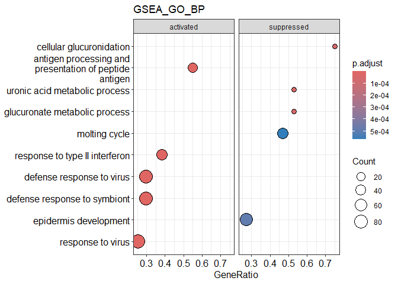

Immune_Bulk_RNAseq_Analysis
================

## Objectives

### Gene expression profiling by RNAseq in melanoma cell lines using data from the journal article “Conserved Interferon-g Signaling Drives Clinical Response to Immune Checkpoint Blockade Therapy in Melanoma”

### Grasso et al., 2020, Cancer Cell 38, 500–515

### In this study the authors have discovered from an immunotherapy cohort that response to immune checkpoint blockade therapy is associated with T-cell infiltration and interferon gamma (IFNG). They modelled the effect of IFNG on human melanoma cell lines.

### They have treated 58 cell lines with IFNG for 6 hours. Among these, some cell lines included mutations in JAK1/JAK2/B2M which might affect the downstream of IFNG pathway consequently the response to IFNG. They conducted RNA-seq before (control) and after IFNG treatment samples to find the transcriptomic changes.

## Data

### Raw gene count data is accessible from GEO with the following accession code:GSE154996

## Setup

``` r
pacman::p_load(tidyverse, readxl, openxlsx, janitor, ggrepel, ggplot2,
               edgeR, DESeq2, EnhancedVolcano, pheatmap,sjmisc,stringr,ComplexHeatmap,
               clusterProfiler,org.Hs.eg.db, AnnotationDbi, conflicted,readxl,gprofiler2)
conflict_prefer("filter", "dplyr") ## IMPORTANT
```

    ## [conflicted] Will prefer dplyr::filter over any other package.

``` r
conflict_prefer("select", "dplyr")
```

    ## [conflicted] Will prefer dplyr::select over any other package.

``` r
conflict_prefer("intersect", "dplyr")
```

    ## [conflicted] Will prefer dplyr::intersect over any other package.

``` r
conflict_prefer("setdiff", "dplyr")
```

    ## [conflicted] Will prefer dplyr::setdiff over any other package.

``` r
rm(list=ls())
```

## Read in count and filtering of genes with no expression

``` r
counts <- read_delim("./data/GSE154996_Raw_Gene_Counts_Matrix.txt") %>% 
  clean_names() 
```

    ## Rows: 19871 Columns: 122
    ## ── Column specification ────────────────────────────────────────────────────────
    ## Delimiter: "\t"
    ## chr   (2): GeneId, GeneChrom
    ## dbl (120): GeneMinPos, GeneMaxPos, GeneBases, GeneExons, M420.Expt.Counts, M...
    ## 
    ## ℹ Use `spec()` to retrieve the full column specification for this data.
    ## ℹ Specify the column types or set `show_col_types = FALSE` to quiet this message.

``` r
counts <- counts %>%
  clean_names() %>%
  select(gene_id, ends_with("_counts")) %>% 
  column_to_rownames("gene_id") 


counts <- counts %>% 
  rename_with(~gsub("_counts", "", .))

n_expressed <- rowSums(counts > 0)
sum(n_expressed==0) #997 genes no expression
```

Note that the `echo = FALSE` parameter was added to the code chunk to
prevent printing of the R code that generated the plot.

``` r
ggplot(data.frame(n_expressed), aes(x=n_expressed)) +
  geom_bar() +
  labs(x="Number of samples expressed in", y="Number of genes") +
  theme_bw(base_size = 20)
```

<!-- -->

``` r
dim(counts) # 19871   116
```

    ## [1] 19871   116

``` r
counts <- counts[ n_expressed > 0, ] 
dim(counts) #18874   116 (997 genes that are not express were removed)
```

    ## [1] 18874   116

## GENE ANNOTATION

``` r
gene_ann <- data.frame(SYMBOL=rownames(counts))  
head(gene_ann, 3)
```

    ##   SYMBOL
    ## 1   A1BG
    ## 2   A1CF
    ## 3    A2M

``` r
map <- clusterProfiler::bitr(gene_ann$SYMBOL,
            fromType = "SYMBOL",
            toType = c("ENTREZID", "GENENAME", "GENETYPE"), 
            OrgDb = "org.Hs.eg.db")
```

    ## 'select()' returned 1:many mapping between keys and columns

    ## Warning in clusterProfiler::bitr(gene_ann$SYMBOL, fromType = "SYMBOL", toType =
    ## c("ENTREZID", : 6.08% of input gene IDs are fail to map...

``` r
tb <- table(map$SYMBOL) 
dup <- names(which(tb > 1)) 
map %>% filter( is.element(SYMBOL, dup) )
```

    ##   SYMBOL  ENTREZID                                            GENENAME
    ## 1    HBD      3045                            hemoglobin subunit delta
    ## 2    HBD 100187828                       hypophosphatemic bone disease
    ## 3   MMD2    221938 monocyte to macrophage differentiation associated 2
    ## 4   MMD2 100505381                        Miyoshi muscular dystrophy 2
    ## 5    TEC      7006                         tec protein tyrosine kinase
    ## 6    TEC 100124696           transient erythroblastopenia of childhood
    ##         GENETYPE
    ## 1 protein-coding
    ## 2        unknown
    ## 3 protein-coding
    ## 4        unknown
    ## 5 protein-coding
    ## 6        unknown

``` r
map <- map %>%
  filter( !is.element(SYMBOL, dup) ) 
dim(map)
```

    ## [1] 17723     4

``` r
gene_ann <- left_join(gene_ann, map)              
```

    ## Joining with `by = join_by(SYMBOL)`

``` r
rownames(gene_ann) <- rownames(counts) 

head(gene_ann)
```

    ##          SYMBOL ENTREZID                                        GENENAME
    ## A1BG       A1BG        1                          alpha-1-B glycoprotein
    ## A1CF       A1CF    29974                  APOBEC1 complementation factor
    ## A2M         A2M        2                           alpha-2-macroglobulin
    ## A2ML1     A2ML1   144568                    alpha-2-macroglobulin like 1
    ## A3GALT2 A3GALT2   127550               alpha 1,3-galactosyltransferase 2
    ## A4GALT   A4GALT    53947 alpha 1,4-galactosyltransferase (P blood group)
    ##               GENETYPE
    ## A1BG    protein-coding
    ## A1CF    protein-coding
    ## A2M     protein-coding
    ## A2ML1   protein-coding
    ## A3GALT2 protein-coding
    ## A4GALT  protein-coding

``` r
rm(tb, dup, map)

dim(gene_ann) # 18874    4
```

    ## [1] 18874     4

## Sample annotation

``` r
sample_ann <- colnames(counts) %>% 
  as.data.frame() %>% 
  setNames("Exp_info") %>% 
  mutate(temp =  sub("_ko_[^_]+$", "", Exp_info),
         Cell_line = sub("_[^_]+$", "", temp), 
         Mutation = ifelse(grepl("jak1_ko", Exp_info),"jak1_ko", 
                           ifelse(grepl("jak2_ko", Exp_info),"jak2_ko",
                                  ifelse(grepl("b2m_ko", Exp_info),"b2m_ko","wt"))),
         Treatment =  str_sub(Exp_info,-4,-1), 
         Treatment =  factor(Treatment, levels=c("ctrl", "expt"))) %>% 
  select(-temp) %>% 
  column_to_rownames('Exp_info') 

sample_ann %>% tabyl(Treatment)
```

    ##  Treatment  n percent
    ##       ctrl 58     0.5
    ##       expt 58     0.5

``` r
write.csv(sample_ann,"./data/sample_ann.csv", row.names = TRUE)
```

## Q1. Generate DESeq2 object using column/count data and make a PCA plot using normalised count data.

## Are control and treatment samples separated on the PCA plot?

``` r
# Check the order of samples in count and sample annotation

identical( colnames(counts), rownames(sample_ann) ) # identical order
```

    ## [1] TRUE

``` r
identical( rownames(counts), rownames(gene_ann) ) # identical order
```

    ## [1] TRUE

``` r
dds <- DESeqDataSetFromMatrix(countData = round(counts),
                              colData = sample_ann,
                              rowData = gene_ann,
                              design = ~ -1 + Treatment + Mutation + Cell_line) 
```

    ## converting counts to integer mode

    ## Warning in DESeqDataSet(se, design = design, ignoreRank): some variables in
    ## design formula are characters, converting to factors

``` r
assay(dds)[ 1:3, 1:5]
```

    ##      m420_expt m420_ctrl wm_1366_ctrl wm_1366_expt m202_ctrl
    ## A1BG       216       296          147          144       132
    ## A1CF         0         0           12           12         0
    ## A2M      39603     11310           88          394       156

``` r
cpm(dds)[1:3, 1:5]
```

    ##       m420_expt m420_ctrl wm_1366_ctrl wm_1366_expt m202_ctrl
    ## A1BG   15.02038  22.16114    8.5674755     9.632616  10.59325
    ## A1CF    0.00000   0.00000    0.6993858     0.802718   0.00000
    ## A2M  2753.94414 846.76535    5.1288289    26.355908  12.51929

``` r
cpm(dds) %>% colSums() %>% head()
```

    ##    m420_expt    m420_ctrl wm_1366_ctrl wm_1366_expt    m202_ctrl    m202_expt 
    ##        1e+06        1e+06        1e+06        1e+06        1e+06        1e+06

``` r
colData(dds)[1:3, ]
```

    ## DataFrame with 3 rows and 3 columns
    ##              Cell_line Mutation Treatment
    ##               <factor> <factor>  <factor>
    ## m420_expt      m420          wt      expt
    ## m420_ctrl      m420          wt      ctrl
    ## wm_1366_ctrl   wm_1366       wt      ctrl

``` r
rowData(dds)[1:3, ]
```

    ## DataFrame with 3 rows and 4 columns
    ##           SYMBOL    ENTREZID               GENENAME       GENETYPE
    ##      <character> <character>            <character>    <character>
    ## A1BG        A1BG           1 alpha-1-B glycoprotein protein-coding
    ## A1CF        A1CF       29974 APOBEC1 complementat.. protein-coding
    ## A2M          A2M           2  alpha-2-macroglobulin protein-coding

``` r
dim(dds) #18874   116
```

    ## [1] 18874   116

``` r
save(dds, file="./data/data_clean.rda", compress=TRUE)
```

## VST expression (Variable stabilizing)

``` r
vst_expr <- vst(dds, blind=FALSE)
norm_count <- assay(vst_expr)

write.csv(norm_count,"./results/normalized_counts.csv", row.names = TRUE) 
```

## PCA Plot (By Treatment)

``` r
plotPCA(vst_expr, intgroup="Treatment") + 
  theme_bw(base_size=20)
```

    ## using ntop=500 top features by variance

<!-- -->
\## PCA Plot (By Mutation)

``` r
plotPCA(vst_expr, intgroup="Mutation") + # Specify color by Treatment as specified in Design
  theme_bw(base_size=20)
```

    ## using ntop=500 top features by variance

<!-- -->
\## Q2. Find differentially expressed genes (DEGs) between pre and post
treatment \## \## samples and compare list of up and down-regulated
genes with author’s list \##

``` r
# Differential Gene Expression

gene_ann <- rowData(dds) %>%
  data.frame() %>%
  select(SYMBOL, ENTREZID)

head(gene_ann, 3)
```

    ##      SYMBOL ENTREZID
    ## A1BG   A1BG        1
    ## A1CF   A1CF    29974
    ## A2M     A2M        2

``` r
dds <- DESeq(dds)
```

    ## estimating size factors

    ## estimating dispersions

    ## gene-wise dispersion estimates

    ## mean-dispersion relationship

    ## final dispersion estimates

    ## fitting model and testing

    ## 10 rows did not converge in beta, labelled in mcols(object)$betaConv. Use larger maxit argument with nbinomWaldTest

``` r
resultsNames(dds)
```

    ##  [1] "Treatmentctrl"       "Treatmentexpt"       "Mutationjak1_ko"    
    ##  [4] "Mutationjak2_ko"     "Mutationwt"          "Cell_linem202"      
    ##  [7] "Cell_linem207"       "Cell_linem233"       "Cell_linem238"      
    ## [10] "Cell_linem238_ar"    "Cell_linem243"       "Cell_linem244"      
    ## [13] "Cell_linem249"       "Cell_linem249_ar"    "Cell_linem257"      
    ## [16] "Cell_linem262"       "Cell_linem263"       "Cell_linem285"      
    ## [19] "Cell_linem297"       "Cell_linem299"       "Cell_linem308"      
    ## [22] "Cell_linem318"       "Cell_linem368"       "Cell_linem370"      
    ## [25] "Cell_linem375"       "Cell_linem376"       "Cell_linem381"      
    ## [28] "Cell_linem383"       "Cell_linem395"       "Cell_linem397"      
    ## [31] "Cell_linem397_ar"    "Cell_linem398"       "Cell_linem399"      
    ## [34] "Cell_linem406"       "Cell_linem407"       "Cell_linem409"      
    ## [37] "Cell_linem410"       "Cell_linem411"       "Cell_linem414"      
    ## [40] "Cell_linem417"       "Cell_linem418"       "Cell_linem420"      
    ## [43] "Cell_lineme215"      "Cell_lineme252"      "Cell_linepb"        
    ## [46] "Cell_lines_bcl2"     "Cell_linesk_mel_176" "Cell_linet1349a"    
    ## [49] "Cell_linet311b"      "Cell_linet618a"      "Cell_linet640a"     
    ## [52] "Cell_linewm_1366"

``` r
# Extract results for ctrl vs. expt 
res <- results(dds, contrast=c("Treatment", "expt", "ctrl")) %>% data.frame() 

res <- res %>%
  rownames_to_column("gene") %>%
  select(SYMBOL=gene, baseMean, LFC=log2FoldChange, p=pvalue, FDR=padj) %>%
  filter(!is.na(LFC), !is.na(FDR)) %>%
  arrange(p) %>%
  left_join(gene_ann) %>% 
  mutate( sig = sign(LFC) * (abs(LFC) > log2(1.5) & FDR < 0.05) )
```

    ## Joining with `by = join_by(SYMBOL)`

``` r
res %>% tabyl(sig) # (downregulated: 41, upregulated: 537)
```

    ##  sig     n     percent
    ##   -1    41 0.002694886
    ##    0 14636 0.962008676
    ##    1   537 0.035296437

``` r
openxlsx::write.xlsx( list(res=res),file="./results/expt_up_deg_L2FC_q_filter.xlsx") 
```

## compare list of up and down-regulated genes with author’s list

``` r
article_selected <- read_excel("./data/mmc3.xlsx", skip = 1) %>%
  select("GeneId") %>% 
  pull()

res_selected <- res %>% 
  filter(sig != 0) %>%
  select("SYMBOL") %>% 
  pull()

library(VennDiagram)
```

    ## Loading required package: futile.logger

``` r
# Venn Diagram to show intersections of two vectors
#svg(file="./results/venn.svg")
v2 <- venn.diagram( x = list(article_selected, res_selected),
                    category.names = c("article_selected", "res_selected"),
                    filename = NULL)
grid.newpage()
grid.draw(v2)
```

<!-- -->

``` r
#dev.off()

intersected_gene <- Reduce(intersect, list(article_selected,res_selected))
openxlsx::write.xlsx( list(intersected_gene=intersected_gene),file="./results/intersected_gene.xlsx") 

res_gene_only <- Reduce(setdiff, list(res_selected, article_selected))
openxlsx::write.xlsx( list(res_gene_only=res_gene_only),file="./results/res_gene_only.xlsx") 

article_gene_only <- Reduce(setdiff, list(article_selected, res_selected)) %>% 
  as.data.frame() %>% 
  pull()
```

## Getting the list of excluded genes in results vs. authors’ list

# Specify the filtering condition of DEGs by (abs(LFC) \> log2(1.5) & FDR \< 0.05)

``` r
article_selected <- read_excel("./data/mmc3.xlsx", skip = 1)

library(data.table)  

article_selected_fc <- article_selected[article_selected$GeneId %in% article_gene_only,] %>% 
                      clean_names() %>% 
                      t() %>% 
                      as.data.frame() 
                      
article_selected_fc <- setDT(article_selected_fc, keep.rownames = "cell_line") %>%  
                       row_to_names(row_number = 1) %>%
                       mutate(cell_line =  sub("_log2fold_[^_]+$", "", gene_id)) %>% 
                       select(c(cell_line, PHF20, SLC26A2, KANK2))   
  
openxlsx::write.xlsx( list(article_selected_fc=article_selected_fc),file="./results/article_selected_fc.xlsx")
```

## Getting the list of intersected genes in our results vs. authors’ list

``` r
article_selected <- read_excel("./data/mmc3.xlsx", skip = 1)

intersected_selected_fc <- article_selected[article_selected$GeneId %in% intersected_gene,] %>% 
                           clean_names() %>% 
                           t() %>% 
                           as.data.frame() 

intersected_selected_fc <- setDT(intersected_selected_fc, keep.rownames = "cell_line") %>%  
  row_to_names(row_number = 1) %>%
  mutate(cell_line =  sub("_log2fold_[^_]+$", "", gene_id)) %>% 
  select(c(cell_line, IRF1, STAT3, TRAFD1))   

openxlsx::write.xlsx( list(intersected_selected_fc=intersected_selected_fc),file="./results/intersected_selected_fc.xlsx")
```

## Q3. Make a volcano plot of up and down-regulated genes.

``` r
# Volcano Plot
# Visualize the biological (log fold change) vs. statistical significance (FDR)

#svg(file="./results/upregulated_genes_treatment.svg")
EnhancedVolcano(res, # results file (non-normalized)
                lab = res$SYMBOL, x = "LFC", y = "FDR",
                FCcutoff = log2(2), pCutoff = 0.05,
                title = "Upregulated genes with IFN-g treatment", subtitle = NULL,
                ylab = bquote(~-Log[10] ~ italic(FDR)), legendPosition = "none")
```

<!-- -->

``` r
#dev.off()
```

## Q4. What are the top up and down regulated pathways?

## Reproduce similar Enrichment Plots in Fig. S9.

``` r
# GSEA with Hallmark

res <- read_excel("./results/expt_up_deg_L2FC_q_filter.xlsx")
ranked <- res %>% 
  arrange( desc(LFC) ) %>% # can also consider p-value for ranking
  select(ENTREZID, LFC) %>%
  na.omit() %>%
  deframe()

length(ranked)
```

    ## [1] 14546

``` r
# Next, prepare the Hallmark database

hallmark <- msigdbr::msigdbr(species = "human", category = "H") %>%
  select(gs_name, entrez_gene) %>%
  unique() %>%
  mutate( gs_name = gsub("HALLMARK_", "", gs_name) )

# Now run GSEA on Hallmark and look at the top few significant pathways:

gsea_hallmark <- GSEA(gene = ranked, TERM2GENE = hallmark)
```

    ## preparing geneSet collections...

    ## GSEA analysis...

    ## Warning in preparePathwaysAndStats(pathways, stats, minSize, maxSize, gseaParam, : There are ties in the preranked stats (0.05% of the list).
    ## The order of those tied genes will be arbitrary, which may produce unexpected results.

    ## Warning in fgseaMultilevel(pathways = pathways, stats = stats, minSize =
    ## minSize, : For some pathways, in reality P-values are less than 1e-10. You can
    ## set the `eps` argument to zero for better estimation.

    ## leading edge analysis...

    ## done...

``` r
gsea_hallmark <- setReadable(gsea_hallmark, OrgDb=org.Hs.eg.db, keyType="ENTREZID")

gsea_hallmark@result %>%
  filter(p.adjust < 1e-4) %>%
  arrange(NES) %>% 
  select(setSize, NES, p.adjust)
```

    ##                           setSize      NES     p.adjust
    ## TNFA_SIGNALING_VIA_NFKB       190 1.876623 1.812160e-05
    ## IL2_STAT5_SIGNALING           181 1.941865 7.521885e-07
    ## COMPLEMENT                    172 2.054611 5.402045e-09
    ## INFLAMMATORY_RESPONSE         170 2.110283 1.250000e-09
    ## IL6_JAK_STAT3_SIGNALING        73 2.185963 3.846466e-09
    ## ALLOGRAFT_REJECTION           146 2.242084 1.250000e-09
    ## INTERFERON_ALPHA_RESPONSE      95 2.515955 1.250000e-09
    ## INTERFERON_GAMMA_RESPONSE     185 2.623823 1.250000e-09

``` r
#svg(file="./results/Dot_blot_HM.svg")
dotplot(gsea_hallmark, showCategory=20, split=".sign") + labs(title="GSEA_Hallmark") + facet_grid(.~.sign)
```

<!-- -->

``` r
#dev.off()
```

## GSEA Plot (INTERFERON_GAMMA_RESPONSE)

``` r
keep <- gsea_hallmark@result %>% 
  filter(ID=="INTERFERON_GAMMA_RESPONSE") %>% 
  pull(core_enrichment) %>% 
  str_split(pattern="\\/") %>% 
  unlist() %>% 
  rev()          

keep <- data.frame(SYMBOL=keep)

left_join(keep, res)
```

    ## Joining with `by = join_by(SYMBOL)`

``` r
# Visualize the enrichment for this pathway

#svg(file="./results/Hallmark INTERFERON_GAMMA_RESPONSE.svg")
gseaplot(gsea_hallmark, geneSetID = "INTERFERON_GAMMA_RESPONSE", title = "Enrichment plot: \n HALLMARK_INTERFERON_GAMMA_RESPONSE")
```

<!-- -->

``` r
#dev.off()
```

## GSEA-GO

``` r
#Running GSEA-GO##
res_up_GO_BP <-gseGO(ranked, 'org.Hs.eg.db', ont="BP", pvalueCutoff=0.01) 
```

    ## preparing geneSet collections...

    ## GSEA analysis...

    ## Warning in preparePathwaysAndStats(pathways, stats, minSize, maxSize, gseaParam, : There are ties in the preranked stats (0.05% of the list).
    ## The order of those tied genes will be arbitrary, which may produce unexpected results.

    ## Warning in fgseaMultilevel(pathways = pathways, stats = stats, minSize =
    ## minSize, : There were 18 pathways for which P-values were not calculated
    ## properly due to unbalanced (positive and negative) gene-level statistic values.
    ## For such pathways pval, padj, NES, log2err are set to NA. You can try to
    ## increase the value of the argument nPermSimple (for example set it nPermSimple
    ## = 10000)

    ## Warning in fgseaMultilevel(pathways = pathways, stats = stats, minSize =
    ## minSize, : For some of the pathways the P-values were likely overestimated. For
    ## such pathways log2err is set to NA.

    ## Warning in fgseaMultilevel(pathways = pathways, stats = stats, minSize =
    ## minSize, : For some pathways, in reality P-values are less than 1e-10. You can
    ## set the `eps` argument to zero for better estimation.

    ## leading edge analysis...

    ## done...

``` r
res_up_GO_BP <- setReadable(res_up_GO_BP, OrgDb=org.Hs.eg.db, keyType="ENTREZID")
## Pull out the top ranking terms. Add geneID to see the genes involved.
res_up_GO_BP@result %>%
  filter(p.adjust < 1e-5) %>%
  select(Description, setSize, NES, p.adjust)
```

``` r
#svg(file="./results/Dot_blot_HM.svg")
dotplot(res_up_GO_BP, showCategory=5, split=".sign") + labs(title="GSEA_GO_BP") + facet_grid(.~.sign)
```

<!-- -->

``` r
#dev.off()
```

## GSEA-GO (GO_RESPONSE_TO_INTERFERON_GAMMA)

``` r
keep2 <- res_up_GO_BP@result %>% 
  filter(ID=="GO:0034341") %>% 
  pull(core_enrichment) %>% 
  str_split(pattern="\\/") %>% 
  unlist() %>% 
  rev()          

keep2 <- data.frame(SYMBOL=keep2)

left_join(keep2, res)
```

    ## Joining with `by = join_by(SYMBOL)`

``` r
#svg(file="./results/GO_Response to interferon-gamma.svg")
gseaplot(res_up_GO_BP, geneSetID = "GO:0034341", title = "Enrichment plot: \n GO_RESPONSE_TO_INTERFERON_GAMMA")
```

<!-- -->

``` r
#dev.off()
```

## The top upregulated pathways are: INTERFERON_GAMMA_RESPONSE, INTERFERON_ALPHA_RESPONSE, IL6_JAK_STAT3_SIGNALING, ALLOGRAFT_REJECTION, INFLAMMATORY_RESPONSE, IL2_STAT5_SIGNALING, COMPLEMENT, TNFA_SIGNALING_VIA_NFKB

``` r
#svg(file="./results/Dot_blot.svg")
g1 <- dotplot(gsea_hallmark, showCategory=20, split=".sign") + labs(title="GSEA_Hallmark") + facet_grid(.~.sign)
g2 <- dotplot(res_up_GO_BP, showCategory=5, split=".sign") + labs(title="GSEA_GO_BP") + facet_grid(.~.sign)
cowplot::plot_grid(g1, g2, nrow=1)
```

<!-- -->

``` r
#dev.off()
```

## Q5. Reproduce similar heatmap in Fig. 3A. (Heatmap of log2 fold change)

## Heatmap

# Read in the csv file containing the genes to plot in heatmap

# Import normalise count

``` r
norm_count2 <- read.csv("./results/normalized_counts.csv")

colnames(norm_count2)[1] ="gene_id"

head(norm_count2)
```

## Import gene list

``` r
gene_list <- read_csv("./data/Heatmap_genes.csv") %>% pull("gene_id")
```

    ## Rows: 52 Columns: 1
    ## ── Column specification ────────────────────────────────────────────────────────
    ## Delimiter: ","
    ## chr (1): gene_id
    ## 
    ## ℹ Use `spec()` to retrieve the full column specification for this data.
    ## ℹ Specify the column types or set `show_col_types = FALSE` to quiet this message.

``` r
filterlist <- norm_count2 %>% 
              filter(gene_id %in% gene_list) %>% 
              column_to_rownames("gene_id") %>% 
              t() %>% 
              as.data.frame() %>% 
              rownames_to_column("sample")  
              
openxlsx::write.xlsx( list(filterlist=filterlist),file="./results/filterlist_vst.xlsx")
```

## Generating log2FC

``` r
DF1 <- filterlist %>% 
       filter(grepl("_expt", sample)) %>% 
       mutate(sample = gsub("_expt", "", sample)) %>% 
       column_to_rownames("sample")

DF2 <- filterlist %>% 
       filter(grepl("_ctrl", sample)) %>% 
       mutate(sample = gsub("_ctrl", "", sample)) %>% 
       column_to_rownames("sample")
```

## Check order of column name

``` r
identical( rownames(DF1), rownames(DF2) )  
```

    ## [1] FALSE

``` r
DF1 = DF1[rownames(DF2),] 

identical( rownames(DF1), rownames(DF2) )
```

    ## [1] TRUE

## subtraction

``` r
L2FC <- DF1 -DF2
min(L2FC)
```

    ## [1] -2.020038

``` r
max(L2FC)
```

    ## [1] 6.935413

``` r
L2FC_mat <- as.matrix(L2FC) %>%  t()

L2FC_mat = L2FC_mat[gene_list,]

pacman::p_load(circlize)

#svg(file="./results/Heatmap.svg", width=10, height=9)
Heatmap(L2FC_mat,cluster_rows = F,
        column_names_gp = grid::gpar(fontsize = 8),column_title = "Samples", row_title = "Gene_list",
        row_names_gp = grid::gpar(fontsize = 8), name = "Scale",
        col = colorRamp2(c(-2, 0, 2), c("blue", "white", "red"))) 
```

<!-- -->

``` r
#dev.off()
```
